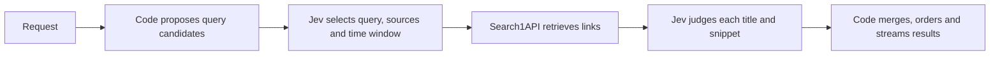

# Jev Search

[All projects](../README.md) · [Apps](README.md) · [Web apps](README.md#web-apps)

Turn a request such as “Find TypeSafe Jev implementations on GitHub this month” into editable search filters and ranked links you can inspect yourself.

| At a glance | Details |
| --- | --- |
| Source | [Source](https://github.com/superagents-lab/jev-search) |
| Tags | `Open source` · `Pricing unverified` · `BYOK` |
| Product homepage | [Jev Search](https://jev.s1.dev) |
| Pricing and access | Hosted pricing/access limits remain unverified as of **2026-09-19**; no pricing terms were found on the inspected [homepage](https://jev.s1.dev). The pinned setup needs TypeSafe and Search1API keys; newer source also offers alternate Jev providers described below. Provider/hosting charges may apply. |
| Jev evidence | [TypeSafe client](https://github.com/superagents-lab/jev-search/blob/522868762f0637b20bf533f136e930cceb83b9f3/src/lib/typesafe.ts) and the pipeline described below were source-reviewed. |
| Disclosure | Open-source code does not establish free hosted use. Built by the search-provider team; independently curated here, with no endorsement or live-search validation. |
| Maintainer | [Search1API / superagents-lab](https://github.com/superagents-lab); built by the search-provider team. Independently curated here, not an upstream submission or TypeSafe endorsement. |
| Format | TypeScript web application using React 19, TanStack Start, and Cloudflare Workers. |
| Platform and availability | Web · [hosted app](https://jev.s1.dev) or self-host from source. Homepage reachability was checked; live search and hosted access limits were not tested. |
| Jev's role | Selects queries, sources, and time windows, then judges result relevance; Search1API retrieves the links. |
| Requirements | Upstream recommends Node.js 22.12+ and pins pnpm 10.8.0. The pinned live setup uses `TYPESAFE_API_KEY` and `SEARCH1API_API_KEY` in private `.dev.vars`; newer provider options are described below. Deployment needs a Cloudflare account. |
| License | [MIT application code](https://github.com/superagents-lab/jev-search/blob/522868762f0637b20bf533f136e930cceb83b9f3/LICENSE); TypeSafe names and brand assets are excluded from that license. |

## When to use

Use this to discover repositories, compare developer discussions across platforms, or build a search interface whose source and recency decisions remain visible. Jev interprets the request and judges topical relevance; the output is links and snippets, with no generated answer.

Ordinary search code is sufficient when users already supply exact keywords and filters. This project becomes useful when “what developers are saying this week” needs translating into source choices. Its ranking does **not** verify that a repository runs, has a usable license, or implements the feature its snippet describes.

## How it works



The [pipeline](https://github.com/superagents-lab/jev-search/blob/522868762f0637b20bf533f136e930cceb83b9f3/src/lib/pipeline.ts) gives Jev predefined candidates rather than asking it to invent search text. Choice questions select the query, a catalogue entity, and one of four windows: any time, 24 hours, seven days, or 30 days. Separate Noul questions judge whether each source fits; code selects sources at probability `0.6` or above, falling back to Google, DuckDuckGo, and Yandex when none qualifies. Explicit source and time selections override these inferences.

GitHub, Reddit, and Hacker News each use two searches: their dedicated engine plus a Google site restriction. Other sources include X, arXiv, YouTube, Wikipedia, IMDb, and WeChat. Each engine requests eight results. A speculative Google request may start before intent inference finishes, even if the eventual inferred source excludes Google.

The [TypeSafe client](https://github.com/superagents-lab/jev-search/blob/522868762f0637b20bf533f136e930cceb83b9f3/src/lib/typesafe.ts) uses the current [HTTP interface](https://docs.typesafe.ai/api), defaulting to `jev-latest`. For each result, a Noul asks whether its title or snippet concerns the requested subject. The displayed “% on topic” is that yes-probability, not a separate confidence or quality score. See [Noul semantics](https://docs.typesafe.ai/primitives/noul).

Code merges normalized URLs and groups similar titles. Best-match ordering uses rounded topical probability, then engine agreement, then original position. Newest uses known ages first. Rows below `0.3` are folded into an expandable group. Streaming preserves already placed rows; changing sort mode recomputes the order.

## Newer provider options

A source-only re-review on **2026-09-19** inspected commit
[`894ea4ce4f1e05cb881f180cab93e21de3f70333`](https://github.com/superagents-lab/jev-search/commit/894ea4ce4f1e05cb881f180cab93e21de3f70333).
Its [provider configuration](https://github.com/superagents-lab/jev-search/blob/894ea4ce4f1e05cb881f180cab93e21de3f70333/src/lib/judge-config.ts)
adds optional Vercel AI Gateway and Cloudflare Workers AI routes. TypeSafe alone
remains the default. `JEV_PROVIDERS` explicitly enables and orders providers;
unlisted providers stay disabled even if credentials exist. Search1API is still
required. Vercel uses `AI_GATEWAY_API_KEY`; Cloudflare uses an `AI` binding and
account access, including remote calls from local development.

The [updated client](https://github.com/superagents-lab/jev-search/blob/894ea4ce4f1e05cb881f180cab93e21de3f70333/src/lib/typesafe.ts)
tries the next configured provider once after HTTP 402, 429 or 5xx, but not after
other client errors or cancellation. Defaults are `jev-latest` for TypeSafe,
`typesafe-ai/jev` for Vercel and `typesafe/jev` for Cloudflare. Vercel boolean
answers are mapped to Noul values. Fallback can send the same request and result
snippets through multiple enabled providers and add usage charges; it is not a
spending cap. Hosted provider configuration and current prices were not verified.

This newer source, README, license and mocked provider/configuration tests were
inspected without installation, test execution or live requests. The walkthrough
and **79-test result below remain pinned to the earlier `5228687` revision**.
Follow the newer [provider setup](https://github.com/superagents-lab/jev-search/blob/894ea4ce4f1e05cb881f180cab93e21de3f70333/README.md#jev-providers)
when choosing an alternate provider; those routes have no execution evidence here.

## Get started

**Use the hosted app:** open [Jev Search](https://jev.s1.dev/) in your browser. The homepage presents a search box and example queries without a sign-in or API-key prompt. A browser inspection on **2026-09-20** verified that interface and its source-code link; no search was submitted, so hosted search availability, quotas, and pricing remain unverified. Submitted searches use the hosted deployment's configured providers. The `BYOK` setup below applies to self-hosting.

**First result: offline tests, no provider keys.** Clone and dependency installation need internet access; the tests themselves mock providers. Use an installed pnpm rather than changing global tool settings.

```sh
git clone https://github.com/superagents-lab/jev-search.git
cd jev-search
git checkout 522868762f0637b20bf533f136e930cceb83b9f3
pnpm install --frozen-lockfile --ignore-scripts
pnpm test
```

Expected result at the reviewed revision: **14 test files and 79 tests pass**. Read [the pipeline tests](https://github.com/superagents-lab/jev-search/blob/522868762f0637b20bf533f136e930cceb83b9f3/test/pipeline.test.ts) next: synthetic Bun-runtime and hair-bun results demonstrate query selection, recency filtering, duplicate merging, explicit overrides, and continued results after a source fails. These are authored responses, not measured Jev accuracy. There is no offline search UI with fixture results.

**Optional live use:** a submitted search sends data to TypeSafe and Search1API and can incur provider charges. For local development, copy `.dev.vars.example` to `.dev.vars`, privately set both keys, run `pnpm dev`, and open `http://localhost:3030`. Begin with one non-sensitive query and a narrow source selection. Follow the [upstream setup and deployment instructions](https://github.com/superagents-lab/jev-search/tree/522868762f0637b20bf533f136e930cceb83b9f3#local-development) for Cloudflare configuration; replace the demo's domain, resource identifiers, analytics, and branding before hosting your own copy.

## Examples and demos

The [hosted application](https://jev.s1.dev) is a live service: submitting a query calls its configured providers. The homepage was reachable during review; a live search was not exercised.

**Synthetic walkthrough:** for “Find TypeSafe Jev implementations on GitHub this month”, the candidate builder produces:

```text
Find TypeSafe Jev implementations on GitHub this month
TypeSafe Jev implementations
TypeSafe Jev
```

Suppose the model selects the second candidate, GitHub, and the month window. The interface should show those filters and stream repository links. The following fabricated results illustrate the display policy; they are not a captured search:

| Hypothetical result | Mock Noul | Expected treatment |
| --- | --- | --- |
| Jev routing starter, returned by two engines | 0.95 | One merged row displaying 95% on topic. |
| Jev API wrapper, returned by one engine | 0.75 | A separate matching result. |
| Unrelated project sharing the name | 0.08 | Kept in the expandable low-match group. |

Open promising repositories and inspect their source, license, and tests before adopting them. A high topic probability cannot do that review for you.

### Adapt it to your workflow

1. **Curate source choices.** For a developer-resource finder, start with the existing GitHub entry in [the source registry](https://github.com/superagents-lab/jev-search/blob/522868762f0637b20bf533f136e930cceb83b9f3/src/lib/sources.ts). Documentation-site searches would be an adaptation: add explicit site-restricted queries and enforce permitted engines and domains in code.
2. **Improve candidate coverage.** Add domain terms and representative requests to candidate tests. Jev cannot select a useful query that code never proposes.
3. **Separate relevance from adoption criteria.** A suggested extension is a second stage over retrieved READMEs, with independent questions about the desired capability. Check licenses, files, and runnable commands separately.
4. **Evaluate before tuning.** Keep a small labeled query/result set; retain raw judgments and the actual returned model version. Tune source and display thresholds against that set. The current app does not persist full TypeSafe responses.

## Limits and data handling

Search failures become per-engine warnings while other engines continue. Reranking failures retain unranked rows, but their initial zero values can place them in the collapsed group. Intent failure stops the search. Missing answers have defaults; full response-schema validation and confidence-based abstention are not implemented.

Recency is approximate: code allows a 1.5-times window tolerance, accounts for day-only date uncertainty, and retains unknown dates. Wikipedia, IMDb, and WeChat receive no provider time filter. Search requests have a 15-second engine timeout within a 30-second endpoint deadline.

TypeSafe receives the request, query candidates, and result titles/snippets; Search1API receives engine queries and filters. Cloudflare hosts the application and optionally caches non-empty engine results in KV for ten minutes to six hours. Cache keys include query text; cache hits still require Jev interpretation and reranking. Search text also appears in browser URLs, and enabled Worker invocation logs may contain those URLs. The demo loads Cloudflare Web Analytics and Google Fonts. Its installable app caches an offline page, not search results.

Self-hosting can incur TypeSafe, Search1API, and Cloudflare charges. The per-IP rate limit is not a spending cap; speculative and multi-engine requests add calls.

## Review and maintenance

AI-assisted source review on **2026-09-19**, pinned to [522868762f0637b20bf533f136e930cceb83b9f3](https://github.com/superagents-lab/jev-search/tree/522868762f0637b20bf533f136e930cceb83b9f3). Reviewed the license, setup, candidate/source definitions, API handling, pipeline, ranking, merging, cache, UI behavior, and relevant tests. Installed dependencies with lifecycle scripts disabled and ran `pnpm test` in a sanitized environment: **79 tests passed** using Node 24.19.0 and pnpm 11.19.0. Upstream's pinned pnpm 10.8.0, production build, deployment, live inference, and retrieval quality were not tested.

Related: [LlamaIndex integration](../tools/llama-index-jev.md) for an existing retrieval pipeline; [RAG triage](../../../examples/rag-triage/README.md) for a smaller offline lesson in separating relevance from evidence sufficiency.
