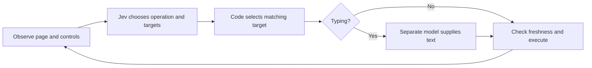

# Jev Ultrafast

[All projects](../README.md) · [Browser automation](../README.md#browser-automation)

Give a browser a goal, inspect its next move, and watch Jev select from the controls actually present on the page.

| At a glance | Details |
| --- | --- |
| Source | [Source](https://github.com/browser-use/jev-ultrafast) |
| Maintainer | [Browser Use](https://github.com/browser-use). Independently curated here; this is not an upstream-owner submission or a claim of endorsement. |
| Format | Experimental Python browser agent, library, and local inspection UI. |
| Requirements | Python 3.12+, uv, Chrome connected through `browser-harness==0.1.13`; `TYPESAFE_API_KEY` for decisions and `TEXT_MODEL_API_KEY` when typing is needed. Uses `httpx`, not the TypeSafe SDK. |
| License | [MIT](https://github.com/browser-use/jev-ultrafast/blob/1231850a0bf1a0c0341fe408ef1668dbbfdfac46/LICENSE). |

## When to use

Study this project if you want an agent to navigate a website, apply search filters, or open a relevant result from a natural-language goal. Its strongest teaching feature is the inspector: you can see the observed elements, competing choices, and executed actions.

For a stable workflow with known selectors or a suitable API, ordinary automation is easier to reproduce. This project is useful when deciding *which available control advances the goal* needs semantic interpretation. It remains a small experimental browser loop, with limited support for complex interfaces.

## How it works

The [model adapter](https://github.com/browser-use/jev-ultrafast/blob/1231850a0bf1a0c0341fe408ef1668dbbfdfac46/jev_ultrafast/model.py) builds a fresh numbered element table. Each element lists its supported operations and current value. One TypeSafe v1 request asks several **Choice** questions:

- Which operation advances the goal: click, type, select, scroll, wait, finish, or report blocked?
- Assuming the operation is click, which clickable element?
- Assuming the operation is type, which editable field?
- Assuming the operation is select, which observed dropdown option?

Only applicable target questions are included. Their premises live in the instructions; question names alone do not tell Jev what to do. These questions are independent, so code consumes only the target matching the selected operation. This is [speculative fan-out](https://docs.typesafe.ai/patterns/fan-out): it avoids a separate operation-then-target request, while extra questions still consume tokens.



Jev receives structured page text, not screenshots. Browser code maps the selected index to an observed DOM node; the model never supplies executable selectors. Typing invokes a separate OpenAI-compatible model, then validates its JSON field value before replacing the input's contents. See the [loop](https://github.com/browser-use/jev-ultrafast/blob/1231850a0bf1a0c0341fe408ef1668dbbfdfac46/jev_ultrafast/agent.py) and [design notes](https://github.com/browser-use/jev-ultrafast/blob/1231850a0bf1a0c0341fe408ef1668dbbfdfac46/docs/design.md).

## Get started

**Installation: network access, no inference.** Clone outside Awesome Jev and pin the reviewed revision:

```sh
git clone https://github.com/browser-use/jev-ultrafast.git
cd jev-ultrafast
git checkout 1231850a0bf1a0c0341fe408ef1668dbbfdfac46
uv sync --frozen
```

**Offline first result: no browser or keys.** After installation:

```sh
uv run --frozen --offline pytest
```

Expect **31 passing tests** covering mocked decisions, invalid responses, stale-page handling, text-cache invalidation, and flight-result verification. These establish code behavior, not successful navigation or model quality.

**Live setup:** follow the upstream [instructions](https://github.com/browser-use/jev-ultrafast/tree/1231850a0bf1a0c0341fe408ef1668dbbfdfac46#try-it). Copy `.env.example` to a private `.env` and configure your keys there. Its text-helper configuration uses OpenRouter with `inception/mercury-2.5`; if those settings are omitted, code defaults to DeepSeek's endpoint and `deepseek-chat`. Match `TEXT_MODEL_BASE_URL`, `TEXT_MODEL`, and `TEXT_MODEL_REASONING` to your provider. `TYPESAFE_MODEL` defaults to the moving `jev-latest` alias; pin a supported version for comparisons.

Chrome must permit Browser Harness remote debugging. The upstream diagnostic is `uv run browser-harness --doctor`; see [Harness connection instructions](https://github.com/browser-use/browser-harness/blob/main/install.md). The agent's new tab shares the connected Chrome profile and its signed-in sessions.

**Live inspector: provider calls may incur charges.** Starting the server itself does not ask Jev; choosing a move sends page state to TypeSafe, and executing a typing move also calls the text provider:

```sh
uv run jev
```

Open `http://127.0.0.1:8766`, select **Reading room · fixture**, then **Start demo → Choose next**. Inspect the operation and target before **Execute choice**. The fixture asks the agent to open an article about controlling browsers with finite choices. Its page content is synthetic, but its decisions are live. **Run automatically** repeats the loop. **Pause** stops subsequent cycles; an in-flight full-speed cycle can still generate text and execute its selected action.

## Examples and demos

- [Synthetic travel and reading fixtures](https://github.com/browser-use/jev-ultrafast/blob/1231850a0bf1a0c0341fe408ef1668dbbfdfac46/jev_ultrafast/static/fixture.html): approachable pages for learning the controls.
- [Generic CLI example](https://github.com/browser-use/jev-ultrafast/blob/1231850a0bf1a0c0341fe408ef1668dbbfdfac46/examples/run.py): supplies a URL and goal; prints elapsed time, action count, status, and final URL. Requires live access.
- [Flight-search example](https://github.com/browser-use/jev-ultrafast/blob/1231850a0bf1a0c0341fe408ef1668dbbfdfac46/examples/flights.py) and [recorded video](https://github.com/browser-use/jev-ultrafast/blob/1231850a0bf1a0c0341fe408ef1668dbbfdfac46/docs/demo.mp4): upstream's real-site demonstration, with independent route/date/result checks. The fixed September 20, 2026 date ages; updating it also requires updating the verifier. It supplies a no-booking instruction, not an enforced purchase-permission boundary.

A synthetic walkthrough of the travel fixture: ask for a Design stay in Lisbon with free cancellation and open Casa Flora. A plausible sequence types Lisbon, submits the search, selects Design, enables the cancellation filter, and opens Casa Flora. At a typing step, code ignores the speculative click target. At a checkbox step, the observed checked state matters: toggling an already enabled filter would undo progress. This illustrates the intended workflow, not a recorded successful run.

## Adapt it to your workflow

1. **Define success in code.** Check the resulting URL, applied filters, and relevant records independently. The flight verifier shows this pattern but does not check passenger count or cabin class. Cover every requirement in your own goal; `DONE` alone is insufficient.
2. **Keep permissions outside the model.** Restrict permitted sites and consequential controls in your application before adapting it to submissions, purchases, or account changes.
3. **Inspect both used choices.** The current loop records probabilities and confidence but has no automatic confidence threshold. Add an evaluated review rule for the operation and its selected target; ignore uncertainty on unused targets.
4. **Debug what was observed.** Check element coverage and page text before rewriting instructions. Retain raw answers for diagnosis, with appropriate redaction, and measure complete tasks across varied pages.

## Limits and data handling

The [executor](https://github.com/browser-use/jev-ultrafast/blob/1231850a0bf1a0c0341fe408ef1668dbbfdfac46/jev_ultrafast/browser.py) checks freshness, node identity, enabled state, geometry, and occlusion before input. Click/select guards permit unrelated content changes; this is a heuristic. Stale decisions trigger observation and another choice. Generated text is reusable only while its entire helper input remains identical. Executed mutations are logged before the next observation; interrupted dropdown execution stops for inspection.

Invalid used choices or text values stop execution. Runs allow 60 executed actions and 120 recorded decision responses; three consecutive non-wait actions without an observed change also stop progress. Selected provider HTTP errors can cause up to three attempts per request, so these counters are not billing caps. Repeated stale text generation can add helper calls.

The DOM reader caps visible text at 6,000 characters and element-action candidates at 250. Frames, shadow roots, canvas, uploads, pop-up tabs, nested scrolling, and complex keyboard widgets are outside the documented scope.

TypeSafe receives the goal, URL, title, visible text, element values, and recent actions. The text provider receives the goal, selected field, page context, and recent actions. Password/file/hidden controls are excluded from candidates, but ordinary text can still contain private information. Target websites see browser activity; the inspector also loads a font stylesheet from `rsms.me`. Keys stay server-side. Inspector traces contain page content, typed values, and raw judgments; exports, optional screenshots, and flight artifacts should remain private. No provider-retention assessment was performed.

## Review and maintenance

AI-assisted source review on **2026-09-19**, at [1231850](https://github.com/browser-use/jev-ultrafast/tree/1231850a0bf1a0c0341fe408ef1668dbbfdfac46), covered source, license, configuration, fixtures, and tests. In a separate checkout with a sanitized environment, frozen dependency installation succeeded on Python 3.14.4; **31 tests passed**, Ruff passed, both JavaScript syntax checks passed, and the wheel/source distribution built. Browser connection, real-browser guard checks, live inference, and upstream timing claims were not reproduced. No workload accuracy or speed claim follows from these checks.

Related: [span selection](../../examples/span-selection/README.md) teaches selecting observed candidates without browser access; [support routing](../../examples/support-routing/README.md) demonstrates explicit review handling.
