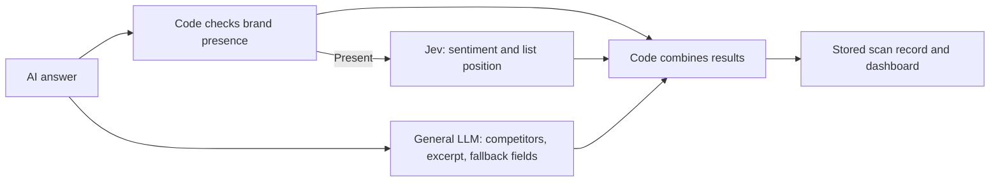

# Notra

[All projects](../README.md) · [Customer feedback and marketing](../README.md#customer-feedback-and-marketing)

Track whether AI answers mention your brand, where it appears in a recommendation list, and how the answer describes it. Notra shows how narrow Jev judgments can become useful fields inside a larger analytics product.

| At a glance | Details |
| --- | --- |
| Source | [Source](https://github.com/usenotra/notra) |
| Maintainer | [Notra](https://github.com/usenotra); independently curated here, not submitted on the maintainer's behalf. |
| Format | TypeScript application: Bun/Turborepo, Next.js dashboard, Hono API, PostgreSQL and Drizzle. |
| Requirements | Reviewed checkout pins Bun **1.4.0**, Node.js **24.11.1**, `ai@7.0.105` and `@ai-sdk/gateway@4.0.85`. The small offline example below needs only Bun and the source. |
| Live access | Server-side `AI_GATEWAY_API_KEY` or Vercel OIDC for `typesafe-ai/jev`; separate model access for scans and the general judge. Full dashboard setup also needs database/auth configuration. |
| License | Main application: [AGPL-3.0](https://github.com/usenotra/notra/blob/59ddfa6b58503d0f02b44b3dfd0dcb2f18c9cb7d/LICENSE). The separately [MIT-licensed traffic SDK](https://github.com/usenotra/notra/blob/59ddfa6b58503d0f02b44b3dfd0dcb2f18c9cb7d/packages/geo/LICENSE) is a different component. |

## When to use

Explore Notra when you want to compare brand visibility across buyer questions, inspect competitors appearing in answers, or connect missing coverage to an editorial backlog. Its dashboard covers scanning, citations, content opportunities and drafting; Jev handles a small part of that workflow.

The reusable lesson is **separate presence from interpretation**. Code can recognize a complete brand name or configured alias. Jev can judge whether the surrounding language praises that brand or merely lists it. If you only need exact name counts, the deterministic matcher may be enough. The full platform is a substantial application to operate, so start by reading its evaluator before choosing to self-host.

## How it works

Follow these three source files:

1. [Brand matcher](https://github.com/usenotra/notra/blob/59ddfa6b58503d0f02b44b3dfd0dcb2f18c9cb7d/packages/geo-core/src/utils/geo-brand-mention.ts): normalizes case and separators, then checks complete company names and aliases with word boundaries.
2. [Questions and composition](https://github.com/usenotra/notra/blob/59ddfa6b58503d0f02b44b3dfd0dcb2f18c9cb7d/packages/geo-core/src/utils/geo-check-evaluation.ts): sends company name, aliases, buyer prompt and assistant answer as state. Jev answers two independent Choices: sentiment (`positive`, `neutral`, `negative`) and list position (`1`–`10`, `none`). These are categories, not a numerical Score.
3. [Orchestration](https://github.com/usenotra/notra/blob/59ddfa6b58503d0f02b44b3dfd0dcb2f18c9cb7d/packages/geo-core/src/geo/check-evaluation.ts): runs Jev only for mentioned brands, alongside a general LLM judge that still supplies competitors and an excerpt. Code combines their answers.



The [evaluation client](https://github.com/usenotra/notra/blob/59ddfa6b58503d0f02b44b3dfd0dcb2f18c9cb7d/packages/ai/src/evaluation/client.ts) uses AI SDK's experimental evaluation interface through Vercel Gateway. It extracts confidence from provider metadata; this differs from the direct [TypeSafe Choice response](https://docs.typesafe.ai/primitives/choice). Read the adapter contract when reimplementing it.

## Get started

**Download source, then run an offline composition example.** Cloning uses the network. The Bun command needs no dependencies, account, database or provider requests; `--no-env-file` prevents loading local environment files.

```sh
git clone https://github.com/usenotra/notra.git
cd notra
git checkout 59ddfa6b58503d0f02b44b3dfd0dcb2f18c9cb7d
bun --no-env-file -e '
import { applyMentionEvaluation } from "./packages/geo-core/src/utils/geo-check-evaluation.ts";
const judge = { mentioned: true, position: 2, sentiment: "positive",
  competitors: ["Paper Kite"], excerpt: "Moon Orchard supports exports." };
const fixture = { sentiment: "neutral", position: null, confidence: {} };
console.log(JSON.stringify(applyMentionEvaluation(judge, true, fixture)));
'
```

Expect `mentioned: true`, `position: null`, `sentiment: "neutral"`, with the competitor and excerpt unchanged. Both supplied results are **synthetic fixtures**. This executes the real merge function and demonstrates which fields Jev may replace; it does not ask Jev to classify the excerpt.

For the existing broader offline test suite, the narrow command is `bun --no-env-file test packages/geo-core/tests/geo-check-evaluation.test.ts` from a dependency-installed checkout. It injects model services. We inspected those tests but did not install the monorepo dependencies or run that suite.

To operate the dashboard, follow the pinned [development instructions](https://github.com/usenotra/notra/blob/59ddfa6b58503d0f02b44b3dfd0dcb2f18c9cb7d/README.md#local-development). They require `DATABASE_URL`, WorkOS AuthKit configuration, `INTEGRATION_ENCRYPTION_KEY` and application URLs; providers and background jobs need additional services. **Fresh database setup has documented migration and foreign-key ordering problems.** Read the [initialization caveat](https://github.com/usenotra/notra/blob/59ddfa6b58503d0f02b44b3dfd0dcb2f18c9cb7d/AGENTS.md#database-schema-init-gotcha-important) before attempting setup. This review did not initialize a database or launch the dashboard.

## Worked example: a fictional export tool

Suppose you track **Moon Orchard**, alias **MoonOrchard**, for “Which tools export weekly project updates?” These are illustrative judgments, not recorded model responses.

| Answer fragment | Mention check | Illustrative Jev answer | Result to inspect |
| --- | --- | --- | --- |
| “1. Paper Kite. 2. Moon Orchard is excellent for weekly exports.” | Present | Positive, position 2 | A favorable list placement. |
| “MoonOrchard supports exports.” | Present | Neutral, no position | A factual mention outside a ranked list. |
| “Paper Kite supports exports.” | Absent | Evaluation skipped | Sentiment and position are cleared. |

Position describes the order of appearance in that answer, including an unordered bullet list or ranked table. It does not establish preference or market rank. A mention and a citation to your website are also separate signals.

## Adapt it thoughtfully

- **Define aliases deliberately.** Literal matching cannot recognize an unconfigured translation or infer that a vague description refers to your company. Test punctuation and names embedded in other words.
- **Preserve evidence.** Save the original answer, question version, raw typed response and whether fallback ran. Notra stores scan answers and final fields, but this path does not persist the full Jev response.
- **Add an uncertainty policy.** Notra extracts confidence but does not gate these overrides on it. Evaluate review thresholds on representative answers; low confidence is not equivalent to neutral sentiment.
- **Handle long lists explicitly.** Upstream preserves the general judge's rank when it exceeds 10. For another application, parse list candidates in code and make candidate coverage explicit.
- **Evaluate repeated scans fairly.** Keep prompts, languages and engine configuration comparable. Review contradictory examples before turning a dashboard change into an editorial decision.

## Examples and demos

The [existing evaluation tests](https://github.com/usenotra/notra/blob/59ddfa6b58503d0f02b44b3dfd0dcb2f18c9cb7d/packages/geo-core/tests/geo-check-evaluation.test.ts) cover overrides, skipped evaluation, absent brands and out-of-range positions. The [product website](https://www.usenotra.com) and [documentation](https://docs.usenotra.com/overview) show the wider workflow. The hosted app requires an account; we did not find or validate a separate credential-free interactive Jev demo.

## Limits and data handling

Jev receives the brand, aliases, buyer prompt and answer through Gateway/TypeSafe. The answer also goes to the configured general judge; scanning sends prompts to selected engine providers. PostgreSQL stores prompts, answers, citations and final analysis. Operational logging can include excerpts, so review configured log destinations too.

The evaluator requests zero data retention and no prompt training. Vercel currently documents [ZDR eligibility](https://vercel.com/docs/ai-gateway/security-and-compliance/zdr) for Pro/Enterprise and rejects requests without an eligible provider. This setting does not establish retention rules for every other model call or Notra's database. Account eligibility and enforcement were not tested.

Unavailable credentials, a disabled `NOTRA_JEV_CLASSIFIERS` flag, or caught evaluation errors leave the general judge's answers in place. The GEO call overrides the shared five-second timeout with **ten seconds**. The general judge remains required: Jev success alone cannot rescue its failure. Low-confidence successful results still override in-range fields. Scans, judging and Jev can all incur usage costs; no latency, accuracy or savings claim was validated.

## Review and maintenance

Reviewed **2026-09-19** at [59ddfa6](https://github.com/usenotra/notra/commit/59ddfa6b58503d0f02b44b3dfd0dcb2f18c9cb7d). AI-assisted source inspection covered implementation, tests, setup, storage and licenses. Bun 1.4.0 ran the composition example and **10 synthetic assertions** against unmodified utility functions with an empty credential environment. These were separate review checks, not the upstream suite.

Full installation, authentication, database bootstrap, live scans, inference and model quality remain untested. See [catalog validation scope](../../docs/validation.md).

Related: [Quality rubric](../../examples/quality-rubric/README.md) offers a smaller offline example of independent judgments and explicit application policy.
