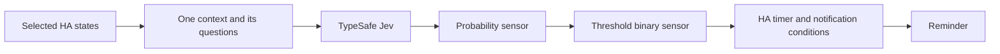

# Jev for Home Assistant

[All projects](../README.md) · [Home automation](README.md#home-automation)

Turn a small selection of household readings into a judgment sensor, inspect its answer, then use an ordinary Home Assistant automation to send a reminder.

| At a glance | Details |
| --- | --- |
| Source | [Source](https://github.com/AboveColin/HA-Jev) |
| Maintainer | [AboveColin](https://github.com/AboveColin). Independently curated here; upstream states no TypeSafe affiliation. |
| Format | Python custom integration with YAML examples, sensors, service actions and an Assist conversation agent. |
| Requirements | Home Assistant 2026.9+, its Python runtime; integration pins `jevclient==1.1.0`. HACS is optional. A TypeSafe account and API key entered through the integration UI are required for evaluation. Tests target Python 3.14. |
| License | [MIT](https://github.com/AboveColin/HA-Jev/blob/1b48f2fa1e94d076b54082f889f04b0083bcd1a8/LICENSE). |

## When to use

Use it for contextual notification triage, household situation labels, or deciding whether a reminder would be useful. You can inspect probabilities in Home Assistant before connecting them to an automation.

If the rule is simply “a completed cycle has not been acknowledged,” a helper and a timer are usually enough. Jev becomes more useful when interpreting varied text or weighing contextual evidence. Keep exact power comparisons, elapsed-time calculations and notification permissions in Home Assistant.

A clearer language-understanding use is [alert triage](https://github.com/AboveColin/HA-Jev/blob/1b48f2fa1e94d076b54082f889f04b0083bcd1a8/examples/02_alert_triage.yaml): distinguish differently worded routine reconnect messages from an unresolved backup failure. One request asks whether human attention is needed, which technical area owns the alert, and how urgent it is. HA then chooses a critical notification, ordinary notification or logbook entry. This example uses `jev.ask`, so it bypasses the sensor budget check described below; adapt its notification policy before running it.

The integration also supports device control through Assist. That is a separate adoption step with real effects on exposed devices; the starting workflow below only reads selected states and sends a reminder.

## How it works

The [state builder](https://github.com/AboveColin/HA-Jev/blob/1b48f2fa1e94d076b54082f889f04b0083bcd1a8/custom_components/jev/statebuilder.py) resolves entity, device, area, floor or label selections into records. Records include state, useful names, units, area and time since the state changed. Extra attributes are excluded unless enabled.

Each context batches its questions into one request. A Noul produces the probability of “yes”; adding `threshold` also creates a binary sensor. Choice and Score sensors retain distributions and confidence attributes. The [Noul documentation](https://docs.typesafe.ai/primitives/noul) explains why its probability is the answer itself, without a separate confidence value.

## Get started

**Offline first:** read [the laundry reminder example](https://github.com/AboveColin/HA-Jev/blob/1b48f2fa1e94d076b54082f889f04b0083bcd1a8/examples/01_laundry_reminder.yaml). Its entity IDs are placeholders. There is no standalone offline household demo; the upstream test suite replaces the API client.

The example selects washing-machine power and a door sensor. It asks whether finished laundry remains in the machine, sets a `0.7` threshold, and sends a phone notification after the binary sensor stays on for ten minutes, during 08:00–22:00.

**Check the evidence before copying it.** Low power and a closed door cannot distinguish a finished load from a machine that never ran. Nor does opening a door prove unloading. The example does not retain cycle history. Our suggested adaptation is to create a Home Assistant helper that records an observed completed cycle and clears when the household acknowledges unloading. Compute the power and timing rules in HA, then supply that helper alongside any contextual evidence Jev needs.

**Live setup — sends data to TypeSafe and may incur charges:**

1. Follow the [installation instructions](https://github.com/AboveColin/HA-Jev/blob/1b48f2fa1e94d076b54082f889f04b0083bcd1a8/README.md#installation). To reproduce this review, manually copy `custom_components/jev` from the linked commit (integration 1.8.0) into HA's `config/custom_components/` directory, then restart HA. HACS is an alternative but may install a newer release; inspect its changes before relying on this revision's behavior.
2. Add **Jev (TypeSafe)** under **Settings → Devices and services**, entering the key privately. Key validation and integration startup make live probe calls. Set a small nonzero daily input-token budget in the options before adding household contexts; `0` means unlimited.
3. Adapt only the example's `jev:` section first. Replace its entity IDs and revise the question around the evidence actually available. Check HA configuration, restart, and inspect the resulting entities before enabling notifications. Disable the integration after the first successful evaluation if you want a bounded inspection.
4. When the readings behave as intended, adapt the example's automation and replace `notify.mobile_app_phone` with your actual notification action. Verify generated entity IDs in HA; renamed entities may differ from the example.

Expected entities are `sensor.jev_laundry_forgotten` for the probability and `binary_sensor.jev_laundry_forgotten` for `probability >= 0.7`. Also inspect the integration's call, input-token and estimated-cost sensors.

### Walk through a synthetic result

These invented values explain the application logic; they are not recorded model responses.

| Situation | Judgment | Result |
| --- | --- | --- |
| Completed-cycle helper is on; unloading is unacknowledged | `0.81` | Binary sensor turns on; notification still waits ten minutes and checks the time window. |
| Evidence is ambiguous | `0.52` | Below the example threshold; no reminder. This does not establish that the laundry is empty. |
| Provider evaluation fails | No fresh answer | Judgment entities become unavailable; treat this as a failed check, not a negative answer. |

The ten-minute hold filters brief changes. It does not independently confirm the model's answer or repair missing evidence. The time window is checked when that hold completes; 08:00 does not itself trigger a reminder. If an overnight pending reminder should be delivered in the morning, add a separate daytime check in your adaptation.

## Adapt it thoughtfully

- **Select the smallest useful input.** Prefer explicit entities over a whole area; adding devices to an area can expand future requests. The selector cap is 250 entities.
- **Check freshness in HA.** `unknown` and `unavailable` readings reach Jev unchanged; absent entity states can be omitted. The provided `changed` field measures state changes, not sensor reporting health. Add availability and reporting-freshness conditions before notification.
- **Control what wakes the context.** Polling defaults to 300 seconds; selected-entity changes also request refreshes through a five-second debounce. Use `trigger_entities` with a stable helper to avoid reacting to every power fluctuation. The scan interval is not a hard request-count limit.
- **Separate meaning from policy.** Batch an independently useful urgency question with the reminder judgment, but keep quiet hours, cooldowns and recipient selection in code. Evaluate thresholds against your household's cases.

## Examples and demos

The upstream [example directory](https://github.com/AboveColin/HA-Jev/tree/1b48f2fa1e94d076b54082f889f04b0083bcd1a8/examples) includes alert triage, situation sensors and optional LLM combinations. These are live integration examples requiring adapted entities; some perform device actions. [Entity screenshots](https://github.com/AboveColin/HA-Jev/blob/1b48f2fa1e94d076b54082f889f04b0083bcd1a8/docs/images/entities.png) show the intended HA surface. They are upstream evidence, not a catalog test run.

## Limits and data handling

**Budget protection has boundaries.** At this revision, sensor updates and Assist check accumulated input tokens before a request, so a request can cross the budget. Direct `jev.noul`, `jev.choice`, `jev.score` and `jev.ask` actions record usage but do **not** enforce that check. Setup probes are not included in usage totals. The budget is therefore not a strict spending cap. See [coordinator](https://github.com/AboveColin/HA-Jev/blob/1b48f2fa1e94d076b54082f889f04b0083bcd1a8/custom_components/jev/coordinator.py) and [service implementation](https://github.com/AboveColin/HA-Jev/blob/1b48f2fa1e94d076b54082f889f04b0083bcd1a8/custom_components/jev/services.py).

Budget and provider failures make context entities unavailable while retaining the previous answers internally. Direct action failures raise errors. Assist can fall back to another configured agent, whose costs and actions are separate. Its own action set covers on/off, toggle, brightness and state queries; whole-house off has an exception to the whole-house restriction. Do not assume enabling Assist is read-only or appropriate for locks, heating or safety systems.

Selected state, names, areas, templates and questions go to TypeSafe via the v1 API using `jev-latest`. Assist additionally sends the utterance and up to 150 exposed controllable entities. HA stores the key and persisted usage totals locally; entity history depends on Recorder settings. Diagnostics include last evaluated states and up to 20 routed utterances; service debug logs can contain request state. Review these before sharing. Provider retention is governed by [TypeSafe's terms](https://docs.typesafe.ai/legal).

Costs follow actual input tokens; the integration multiplies recorded usage by a configurable price. Its default is $0.042 per million input tokens, matching the [published model price](https://docs.typesafe.ai/models) reviewed on 2026-09-19. Check current pricing and account usage; do not treat the local estimate as an invoice.

## Review and maintenance

Reviewed on **2026-09-19**, integration **1.8.0**, commit [`1b48f2fa1e94d076b54082f889f04b0083bcd1a8`](https://github.com/AboveColin/HA-Jev/commit/1b48f2fa1e94d076b54082f889f04b0083bcd1a8). AI-assisted inspection covered setup, state selection, sensors, updates, actions, Assist, diagnostics, examples and tests.

Offline checks compiled 28 Python files and parsed 15 YAML examples. Targeted execution of extracted usage-accounting code checked budget crossing, persistence restoration and rollover; `jevclient==1.1.0` serialized the laundry question and parsed a synthetic response. These checks did not run HA schemas or the full integration suite. HA installation, live inference, devices and model quality were not tested.

Related: [Decision patterns](../../../docs/decision-patterns.md) explains typed judgments and application policy before you connect them to household events.
