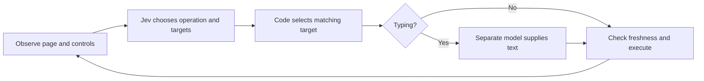

# Jev Ultrafast

[All projects](../README.md) · [Browser and computer use](README.md#browser-and-computer-use)

Learn a compact browser-agent loop: give it a goal, inspect the observed controls, and see Jev choose an operation and target. Start with a synthetic choice that needs no browser or account.

| At a glance | Details |
| --- | --- |
| Source | [Source](https://github.com/browser-use/jev-ultrafast) |
| Maintainer | [Browser Use](https://github.com/browser-use). Independently curated here; this is not an upstream-owner submission or a claim of endorsement. |
| Format | Experimental Python browser agent, library, and local inspection UI. |
| Requirements | Git, Python 3.12+, uv; Chrome is needed only for actual browser operation, connected through `browser-harness==0.1.13`; `TYPESAFE_API_KEY` for decisions and `TEXT_MODEL_API_KEY` when typing is needed. Uses `httpx`, not the TypeSafe SDK. |
| License | [MIT](https://github.com/browser-use/jev-ultrafast/blob/1231850a0bf1a0c0341fe408ef1668dbbfdfac46/LICENSE). |

## When to use

Study this project if you want an agent to navigate a website, apply search filters, or open a relevant result from a natural-language goal. Its strongest teaching feature is the inspector: you can see the observed elements, competing choices, and executed actions.

For a stable workflow with known selectors or a suitable API, ordinary automation is easier to reproduce. This project is useful when deciding *which available control advances the goal* needs semantic interpretation. It remains a small experimental browser loop, with limited support for complex interfaces.

| You want to… | Useful starting point | You still supply… |
| --- | --- | --- |
| Understand operation/target selection | The synthetic walkthrough below | A representative candidate table and labeled expected decisions |
| Find and open a relevant article | Reading-room fixture and inspector | A check of the final URL and article content |
| Search a site and apply filters | Travel fixture | Text-provider credentials when typing, plus checks of each filter |
| Explore browser testing | A disposable test site and the `Agent` library | Fixtures, cleanup, independent assertions, and action permissions |

For direct form values, table extraction, or existing Playwright tests, [Jev Browser](jev-browser-tontoko.md) has a more suitable SDK. Ultrafast does not provide a structured extraction interface or a native macOS/iOS driver.

## How it works

The [model adapter](https://github.com/browser-use/jev-ultrafast/blob/1231850a0bf1a0c0341fe408ef1668dbbfdfac46/jev_ultrafast/model.py) builds a fresh numbered element table. Each element lists its supported operations and current value. One TypeSafe v1 request asks several **Choice** questions:

- Which operation advances the goal: click, type, select, scroll, wait, finish, or report blocked?
- Assuming the operation is click, which clickable element?
- Assuming the operation is type, which editable field?
- Assuming the operation is select, which observed dropdown option?

Only applicable target questions are included. Their premises live in the instructions; question names alone do not tell Jev what to do. These questions are independent, so code consumes only the target matching the selected operation. This is [speculative fan-out](https://docs.typesafe.ai/patterns/fan-out): it avoids a separate operation-then-target request, while extra questions still consume tokens.



Jev receives structured page text, not screenshots. Browser code maps the selected index to an observed DOM node; the model never supplies executable selectors. Typing invokes a separate OpenAI-compatible model, then validates its JSON field value before replacing the input's contents. See the [loop](https://github.com/browser-use/jev-ultrafast/blob/1231850a0bf1a0c0341fe408ef1668dbbfdfac46/jev_ultrafast/agent.py) and [design notes](https://github.com/browser-use/jev-ultrafast/blob/1231850a0bf1a0c0341fe408ef1668dbbfdfac46/docs/design.md).

## Get started

### 1. Install and check the reviewed source

Use the official [uv installation instructions](https://docs.astral.sh/uv/getting-started/installation/) if `uv --version` is unavailable. Clone outside Awesome Jev and keep the following commands in the `jev-ultrafast` checkout. Installation downloads dependencies but makes no inference requests:

```sh
git clone https://github.com/browser-use/jev-ultrafast.git
cd jev-ultrafast
git checkout 1231850a0bf1a0c0341fe408ef1668dbbfdfac46
uv sync --frozen
uv run --frozen --offline pytest -q
```

Expect **31 passing tests** covering mocked decisions, invalid responses, stale-page handling, text-cache invalidation, and flight-result verification. Neither Chrome nor provider keys are required. `--offline` prevents uv dependency downloads; the tests themselves mock providers and browser operations.

### 2. See one choice without a browser or key

Save this original walkthrough as **`catalog-choice.py` in the upstream checkout root**. It supplies two synthetic article links to the actual request builder and answer validator, then substitutes an authored provider response. Default execution makes **zero provider requests** and executes **zero browser actions**.

```python
import argparse
import getpass
import json
import os
from unittest.mock import patch

from jev_ultrafast import model

parser = argparse.ArgumentParser()
parser.add_argument('--live', action='store_true')
args = parser.parse_args()
state = {
    'url': 'https://example.invalid/reading',
    'title': 'Synthetic reading room',
    'text': 'Choose an article: Baking bread; Browser automation with finite choices.',
    'actions': [
        {'id': 'bread', 'kind': 'click', 'node': 1, 'role': 'link', 'label': 'Baking bread'},
        {'id': 'browser', 'kind': 'click', 'node': 2, 'role': 'link',
         'label': 'Browser automation with finite choices'},
    ],
}
goal = 'Open the article about browser automation with finite choices.'

def synthetic_response(_url, _key, body):
    answers = {}
    for name, question in body['questions'].items():
        selected = 'CLICK' if name == 'operation' else '2'
        answers[name] = {
            'choice': selected, 'confidence': 1.0,
            'probabilities': {key: float(key == selected) for key in question['criteria']},
        }
    return {'model': 'synthetic-test-engine', 'answers': answers}

if args.live:
    if not os.environ.get('TYPESAFE_API_KEY'):
        os.environ['TYPESAFE_API_KEY'] = getpass.getpass('TypeSafe key (hidden): ')
    os.environ.setdefault('TYPESAFE_MODEL', 'jev-1.13.0')
    result = model.choose(state, goal, [])  # One decision; up to 3 HTTP attempts.
else:
    with patch.dict(os.environ, {'TYPESAFE_API_KEY': 'synthetic-unused'}):
        with patch.object(model, 'post_json', synthetic_response):
            result = model.choose(state, goal, [])
    assert (result['operation'], result['choice']) == ('CLICK', 'browser')

print(json.dumps({
    'mode': 'live' if args.live else 'synthetic',
    'operation': result['operation'], 'action_id': result['choice'],
    'raw_answers': result['raw_answers'], 'browser_actions': 0,
}, indent=2))
```

Run it:

```sh
uv run --frozen --offline python catalog-choice.py
```

Expected output includes `"mode": "synthetic"`, `"operation": "CLICK"`, `"action_id": "browser"`, and `"browser_actions": 0`, plus both synthetic answer distributions. Notice that target `"2"` maps back to the observed action ID `"browser"`; it is not a model-generated selector. This tests request construction and choice mapping, not semantic quality or real browser execution.

### 3. Optionally try a bounded live choice

Obtain a key through [TypeSafe API keys](https://console.typesafe.ai/keys). This command uses an existing `TYPESAFE_API_KEY` or prompts for it without echoing or saving it. Never paste the key into chat or source code.

**Explicit live opt-in:** one call to the decision function sends only the synthetic state and goal above to TypeSafe and may incur charges. Upstream retries selected provider HTTP errors, so the bound is **one logical decision and at most three HTTP attempts**. There is no text-helper call and no browser connection or action.

```sh
uv run --frozen --offline python catalog-choice.py --live
```

Here `--offline` applies to uv's dependency resolver, **not** the Python program; `--live` deliberately enables its API call. The walkthrough uses `jev-1.13.0` unless `TYPESAFE_MODEL` is already configured. This pin was listed in the [model documentation](https://docs.typesafe.ai/models) when checked on 2026-09-19; aliases can move.

A successful response prints `"mode": "live"` and the actual operation, target mapping, and raw answers. Unlike the authored fixture, the model can choose a different action or report `DONE`/`BLOCKED`. Inspect that result; no selection is executed. This paid path was source-reviewed but not run here.

### 4. Configure the browser inspector

Only continue when ready to connect a test browser. Chrome must permit Browser Harness remote debugging; follow the [Harness connection instructions](https://github.com/browser-use/browser-harness/blob/main/install.md) and run its diagnostic:

```sh
uv run --frozen --offline browser-harness --doctor
```

The agent opens a new tab in the connected Chrome profile and shares that profile's signed-in sessions. Prepare a dedicated test profile/session before following those connection instructions. The offline walkthrough above does not require this access.

The inspector loads `.env` from its working directory. Copy the template **only if `.env` does not already exist**, then edit it privately:

```sh
cp -n .env.example .env
chmod 600 .env
```

Set `TYPESAFE_API_KEY`. For typing steps, also configure `TEXT_MODEL_API_KEY`, `TEXT_MODEL_BASE_URL`, `TEXT_MODEL`, and `TEXT_MODEL_REASONING` together. The supplied template targets OpenRouter with `inception/mercury-2.5`; if those settings are omitted, code defaults to DeepSeek's endpoint and `deepseek-chat`. A TypeSafe key is not a text-provider key. The pure selection walkthrough needs no text-provider account.

Set `TYPESAFE_MODEL=jev-1.13.0` deliberately for the inspected model pin or select another currently supported version. Keep `.env` ignored. The inspector's simple loader expects unquoted `NAME=value` lines; existing environment variables take precedence. Library scripts need `uv run --env-file .env …` or an already-configured process environment instead.

### 5. Inspect one real-browser decision

Starting the server itself makes no inference request:

```sh
uv run --frozen --offline jev
```

Open `http://127.0.0.1:8766`. Select **Reading room · fixture**, then **Start demo → Choose next** once. This submits the synthetic fixture's observed page state to TypeSafe: **one decision, up to three HTTP attempts**. Look at the operation and target, then stop at this checkpoint. No browser action has yet been executed by that choice.

For a separate, deliberate execution step, use **Execute choice** only after inspecting it. A click needs no text helper; a typing action can add up to three helper HTTP attempts. Confirm that the expected article actually opens and check the URL/content independently. Do not treat the `DONE` decision as the assertion.

**Run automatically** opts into the larger loop, with the limits below; it is not the bounded first-call recipe. **Pause** stops subsequent cycles, but an in-flight full-speed cycle can still generate text and execute its selected action. We did not connect Chrome or run this live inspector during review.

## Examples and demos

- [Synthetic travel and reading fixtures](https://github.com/browser-use/jev-ultrafast/blob/1231850a0bf1a0c0341fe408ef1668dbbfdfac46/jev_ultrafast/static/fixture.html): approachable pages for learning the controls.
- [Generic CLI example](https://github.com/browser-use/jev-ultrafast/blob/1231850a0bf1a0c0341fe408ef1668dbbfdfac46/examples/run.py): supplies a URL and goal; prints elapsed time, action count, status, and final URL. Requires live access.
- [Flight-search example](https://github.com/browser-use/jev-ultrafast/blob/1231850a0bf1a0c0341fe408ef1668dbbfdfac46/examples/flights.py) and [recorded video](https://github.com/browser-use/jev-ultrafast/blob/1231850a0bf1a0c0341fe408ef1668dbbfdfac46/docs/demo.mp4): upstream's real-site demonstration, with independent route/date/result checks. The fixed September 20, 2026 date ages; updating it also requires updating the verifier. It supplies a no-booking instruction, not an enforced purchase-permission boundary.

An illustrative travel-fixture recipe (not a recorded successful run): ask for a Design stay in Lisbon with free cancellation and open Casa Flora. A plausible sequence types Lisbon, submits the search, selects Design, enables the cancellation filter, and opens Casa Flora. At a typing step, code ignores the speculative click target. At a checkbox step, the observed checked state matters: toggling an already enabled filter would undo progress. Verify the selected city, category, checked cancellation control, and opened listing separately. This is an example workflow, not evidence of reliability.

## Common adaptations

| Workflow | Adapt the input | Define success in your code |
| --- | --- | --- |
| Knowledge-base navigation | A narrow goal naming the topic and permitted site | Expected article URL plus required content |
| Product or hotel search | Destination/product, exact filters, and stop point | Applied filters and each required property of the opened result |
| Synthetic form testing | A test-only form and known expected values | Field values, submission count, and persisted test record |
| Browser regression exploration | A local/staging site and short task | A separate assertion after each meaningful action; preserve failing traces privately |

The existing `examples/run.py` accepts `--url` and `--goal`, but its `Agent.run()` repeats decisions automatically. It is an advanced live path, not the one-choice checkpoint. Add an application-level attempt budget before broader use. For exact text supplied by your code, changing Ultrafast requires an explicit adaptation: upstream's typing path still invokes its helper even when the goal quotes the desired text.

## Adapt it to your workflow

1. **Define success in code.** Check the resulting URL, applied filters, and relevant records independently. The flight verifier shows this pattern but does not check passenger count or cabin class. Cover every requirement in your own goal; `DONE` alone is insufficient.
2. **Keep permissions outside the model.** Restrict permitted sites and consequential controls in your application before adapting it to submissions, purchases, or account changes.
3. **Inspect both used choices.** The current loop records probabilities and confidence but has no automatic confidence threshold. Add an evaluated review rule for the operation and its selected target; ignore uncertainty on unused targets.
4. **Debug what was observed.** Check element coverage and page text before rewriting instructions. Retain raw answers for diagnosis, with appropriate redaction, and measure complete tasks across varied pages.

## Troubleshooting

| Symptom | Next step |
| --- | --- |
| uv reports a Python version problem | Use Python 3.12+ and rerun `uv sync --frozen`; keep the lockfile. |
| Missing `TYPESAFE_API_KEY` | The walkthrough can prompt in an interactive terminal. The inspector needs its private `.env` or process environment; never print a key to check it. |
| `TYPE_TEXT needs TEXT_MODEL_API_KEY` | Configure the helper provider's key and matching endpoint/model, or return to the choice-only example. |
| Chrome connection fails | Follow Browser Harness's `--doctor` output and connection guide for your test profile. An offline pytest pass does not verify this connection. |
| Port 8766 is occupied | Set `TYPESAFE_DEMO_PORT=8767` for the inspector and open that loopback port. |
| `StalePage` or “Choose again” | Refresh observation and inspect a new choice; do not reuse the old element index. |
| Invalid provider response / 429 / timeout | Stop after the bounded attempt; inspect status and configured model/provider before a deliberate retry. |
| Required control is absent from the element table | Check the observation first. A frame, canvas, nested scroller, or unsupported widget may need another driver. |
| Agent reports `DONE` but the task is incomplete | Strengthen your independent verifier and narrow the goal; model completion is not proof. |

## Limits and data handling

The [executor](https://github.com/browser-use/jev-ultrafast/blob/1231850a0bf1a0c0341fe408ef1668dbbfdfac46/jev_ultrafast/browser.py) checks freshness, node identity, enabled state, geometry, and occlusion before input. Click/select guards permit unrelated content changes; this is a heuristic. Stale decisions trigger observation and another choice. Generated text is reusable only while its entire helper input remains identical. Executed mutations are logged before the next observation; interrupted dropdown execution stops for inspection.

Invalid used choices or text values stop execution. Runs allow 60 executed actions and 120 recorded decision responses; three consecutive non-wait actions without an observed change also stop progress. Selected provider HTTP errors can cause up to three attempts per request, so these counters are not billing caps. Repeated stale text generation can add helper calls.

The DOM reader caps visible text at 6,000 characters and element-action candidates at 250. Frames, shadow roots, canvas, uploads, pop-up tabs, nested scrolling, and complex keyboard widgets are outside the documented scope.

TypeSafe receives the goal, URL, title, visible text, element values, and recent actions. The text provider receives the goal, selected field, page context, and recent actions. Password/file/hidden controls are excluded from candidates, but ordinary text can still contain private information. Target websites see browser activity; the inspector also loads a font stylesheet from `rsms.me`. Keys stay server-side. Inspector traces contain page content, typed values, and raw judgments; exports, optional screenshots, and flight artifacts should remain private. No provider-retention assessment was performed.

## Review and maintenance

AI-assisted source review on **2026-09-19**, at [1231850](https://github.com/browser-use/jev-ultrafast/tree/1231850a0bf1a0c0341fe408ef1668dbbfdfac46), covered source, license, configuration, fixtures, and tests. In a separate checkout with a sanitized environment, frozen dependency installation succeeded on Python 3.14.4; **31 tests passed**, Ruff passed, both JavaScript syntax checks passed, and the wheel/source distribution built. Browser connection, real-browser guard checks, live inference, and upstream timing claims were not reproduced. No workload accuracy or speed claim follows from these checks.

For this expanded guide, a fresh pinned checkout installed with `uv sync --frozen`; `uv run --frozen --offline pytest -q` again passed **31 tests** on Python 3.14.4. The exact `catalog-choice.py` synthetic walkthrough passed with provider keys absent and returned the expected action mapping with zero browser actions. The model adapter's retry count, environment loading, text-helper requirements, and current TypeSafe model documentation were rechecked. This walkthrough is original catalog teaching code around the upstream adapter; its one-hot responses are synthetic fixtures, not recorded predictions. The live walkthrough and Chrome setup remain unexecuted.

Related: [computer-use comparison](../../../docs/computer-use.md) · [Jev Browser for Playwright tests and extraction](jev-browser-tontoko.md) · [offline computer-use cycle](../../../examples/computer-use/README.md). The [span selection](../../../examples/span-selection/README.md) teaches selecting observed candidates without browser access; [support routing](../../../examples/support-routing/README.md) demonstrates explicit review handling.

<!-- knowledge:backlinks:start -->
## Knowledge guides

- [Replace LLM decision calls with a Jev gate in Python](../../knowledge-base/articles/jev-decision-gate.md) — Mentioned in the source article. Rebuild the option list from what exists each turn and verify outcomes outside Jev.
- [Jev use cases: nine patterns developers are building](../../knowledge-base/articles/jev-use-cases.md) — Mentioned in the source article. Pattern 1: let Jev pick a browser agent's next action from the controls on the page.
- [Jev decision audits: validate the business case](../../knowledge-base/articles/jev-decision-audit.md) — Mentioned in the source article. Check the full outcome after a cheap decision.
<!-- knowledge:backlinks:end -->
