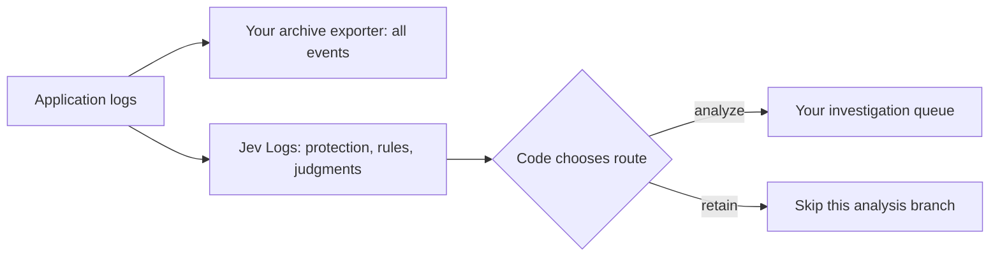

# Jev Logs

[All projects](../README.md) · [Developer tools](README.md#developer-tools)

Decide which application logs deserve deeper investigation while keeping a separate archive of every event. Jev Logs gives Node.js developers a CLI, a triage function, and OpenTelemetry integrations for that decision.

| At a glance | Details |
| --- | --- |
| Source | [Source](https://github.com/reachjalil/jevlogs) |
| Maintainer | [reachjalil](https://github.com/reachjalil); independently curated here, not submitted on the maintainer's behalf. |
| Format | TypeScript library, CLI, exporter wrapper, and local OTLP receiver; v0.3.0 public preview. |
| Requirements | Node.js 22+; pnpm for source builds. Uses `ai@7.0.105`. OpenTelemetry integration targets `@opentelemetry/sdk-logs@0.222.0`; the HTTP example also uses its matching OTLP HTTP exporter. |
| Live access | Server-side `AI_GATEWAY_API_KEY` and Jev access through Vercel AI Gateway. The default evaluator requests zero data retention; check the account requirements below. |
| License | [MIT](https://github.com/reachjalil/jevlogs/blob/b1ff60079c30d50a7f93dbfa09848f9539665d44/LICENSE). |

## When to use

Start here if you already collect logs and want to experiment with prioritizing an incident-analysis queue, annotating records for investigation, or avoiding reasoning-model calls for routine successes. The downstream analysis model and durable archive remain your application's responsibility.

For known health-check paths or exact error codes, ordinary rules are easier to inspect. Jev becomes useful when the wording carries the signal: a successful request, an ambiguous retry, and a failed business operation may need different treatment even at the same log level. This tool supplies neither root-cause explanations nor automatic remediation.

## How it works

The [triage implementation](https://github.com/reachjalil/jevlogs/blob/b1ff60079c30d50a7f93dbfa09848f9539665d44/src/index.ts) first protects errors and explicitly protected records, then redacts the input, applies configured rules, and checks its cache. Remaining records receive three independent judgments in one Jev request:

- A boolean probability that deeper investigation would help.
- A Choice for operational priority.
- A five-level diagnostic-value Score, multiplied by 25 in code to produce 0–100.

The AI SDK calls the first primitive `boolean` and exposes `probability`; TypeSafe's direct API calls it [Noul](https://docs.typesafe.ai/primitives/noul). It has no separate confidence score. See the [Gateway evaluation contract](https://vercel.com/docs/ai-gateway/modalities/evaluation) for the adapter's field names.

With default settings, model-evaluated records receive `retain` only when probability is below `0.1`, value is at most `25`, and priority is `low`. Otherwise they receive `analyze`. The probability cutoff is configurable through `retainBelow`; the value and priority conditions are fixed at this revision. **`retain` is a routing recommendation; it does not save the record.**



## Get started

**Install/build, then offline demo:** from a development directory, with Node.js 22+ and pnpm installed. Cloning and dependency installation use the network; the demo uses fixed synthetic answers and needs no account.

```sh
git clone https://github.com/reachjalil/jevlogs.git
cd jevlogs
git checkout b1ff60079c30d50a7f93dbfa09848f9539665d44
pnpm --filter jevlogs install --frozen-lockfile --ignore-scripts
pnpm build
node dist/cli.js --demo --json
```

Expect four JSON decisions: two `retain`, two `analyze`. The payment error has `reason: "protected"` and `actionableProbability: null` because code bypasses inference. Other demo rows can say `reason: "model"`; their enclosing `mode: "demo"` identifies them as fixtures. The summary's “logs preserved” means inputs were left unchanged, not archived by the CLI.

**Optional live sample, not run in this review:** configure `AI_GATEWAY_API_KEY` privately in the environment, then use `node dist/cli.js --live --sample --json`. It sends three unprotected built-in samples to Gateway/TypeSafe, with SDK retries disabled, and may incur charges. `--live` by itself starts a persistent receiver instead. Custom file/stdin inputs require explicit `--live`; the default CLI cannot classify your own files offline. [Upstream usage guide](https://github.com/reachjalil/jevlogs/blob/b1ff60079c30d50a7f93dbfa09848f9539665d44/docs/guide.md).

## Worked example: three checkout events

These are synthetic inputs and injected evaluator answers checked against the routing code, not measured Jev predictions. Assume your archive receives all three independently.

| Event | Evaluator answer or local override | Decision | Your analysis consumer |
| --- | --- | --- | --- |
| INFO: health endpoint returned 200 | Value `0`, priority `low`, probability `0.01` | `retain`, reason `model` | Skip deeper analysis. |
| ERROR: payment capture failed after retries | No evaluator call; local override sets value `100`, priority `critical`, probability `null` | `analyze`, reason `protected` | Queue the failure. |
| INFO: retrying a partner webhook | Value `25`, priority `low`, probability `0.5` | `analyze`, reason `uncertain` | Keep the ambiguous event available for investigation. |

The retry example shows why value alone is insufficient. A low-value answer does not remove a record when the investigation judgment is uncertain. The returned `Decision` preserves these three scalar judgments, but the default evaluator discards the full Choice/Score distributions and provider response. Capture those with a custom evaluator if you need to audit model behavior.

## Adapt it thoughtfully

1. **Annotate first.** Default `annotate` mode forwards every record with `jev.*` attributes. Inspect those beside incident outcomes before enabling `analysis-only` on a separate branch.
2. **Protect known obligations in code.** Set `protected: true`, or OTel attribute `jev.protected: true`, for audit events. ERROR/FATAL/CRITICAL text or severity number 17+ also bypasses inference. These overrides take precedence over custom rules.
3. **Make rules precise.** A rule matching only `^GET /health` could also match a non-ERROR health failure. Include the success condition; first matching rule wins.
4. **Handle missing decisions.** Overlapping calls to the exporter wrapper can forward records unchanged. Treat absent `jev.route` as eligible for investigation, as the upstream consumer example does.
5. **Measure before filtering.** Compare false negatives and actual bills on representative labeled logs. `estimateSavings()` is arithmetic, not evidence; its `retainedFraction` means the fraction sent to downstream analysis, not the archive fraction.

## Examples and demos

- [Archive and analysis pipeline](https://github.com/reachjalil/jevlogs/blob/b1ff60079c30d50a7f93dbfa09848f9539665d44/skills/jevlogs/examples/otel-pipeline.ts): two processors and a consumer stub; live triage requires Gateway access. Replace the console archive and in-memory queue with your own durable destinations.
- [Synthetic JSONL cases](https://github.com/reachjalil/jevlogs/blob/b1ff60079c30d50a7f93dbfa09848f9539665d44/skills/jevlogs/examples/sample.jsonl): routine, failure, audit, and adversarial examples. Labels are fixtures, not evaluated results.
- [Website guide](https://jevlogs.com/guide/): CLI, receiver configuration, redaction, and troubleshooting. There is no hosted log-analysis service to connect to.

## Limits and data handling

Only body and severity enter the standard redacted model state. Default redaction covers common labeled secrets, bearer tokens, and email addresses; domain-specific sensitive content needs your own redactor. Original bodies and OTel context still reach your exporters or `onLog` callback. JSON CLI output omits bodies. The default cache stores decisions under hashes of redacted input in memory: up to 1,000 entries for five minutes.

Requests set `zeroDataRetention: true`. Vercel currently documents that feature for Pro/Enterprise and rejects requests when no eligible provider exists; check [Gateway retention requirements](https://vercel.com/docs/ai-gateway/security-and-compliance/zdr). This review did not verify account eligibility or provider retention in practice. Gateway inference and any downstream model incur usage costs; storage and ingestion costs remain separate.

Timeouts, invalid answers, redactor errors, and oversized model state yield `analyze` with `reason: "unavailable"`; finite CLI batches exit `2` for unavailable evaluations. The default timeout is two seconds and state limit 8,000 characters. Underlying provider errors are not included in the decision.

The receiver supports loopback, uncompressed OTLP HTTP/JSON only, with a 1 MiB/100-record request limit. It has no durable spool. Forwarding failures return retryable `503`; callback failures return partial success, whose rejected records are not retried by compliant OTLP clients. Successful HTTP handling is not proof of durable storage.

## Review and maintenance

Reviewed on **2026-09-19** at [b1ff600](https://github.com/reachjalil/jevlogs/commit/b1ff60079c30d50a7f93dbfa09848f9539665d44). AI-assisted inspection covered implementation, CLI/configuration, tests, examples, and license. With an empty credential environment and Node.js 24.19.0, `pnpm test` passed **32 tests**, with **one live test skipped**; `pnpm check:examples` passed. The built demo and the three-event scenario above also passed. Receiver tests used synthetic loopback fixtures.

Live inference, production delivery, incident recall, latency, billing, and retention enforcement were not tested. These checks establish application behavior, not model quality. See [catalog validation scope](../../../docs/validation.md).

Related: [RAG triage](../../../examples/rag-triage/README.md) teaches the same judgment-to-routing boundary with a smaller, dependency-free offline example.
