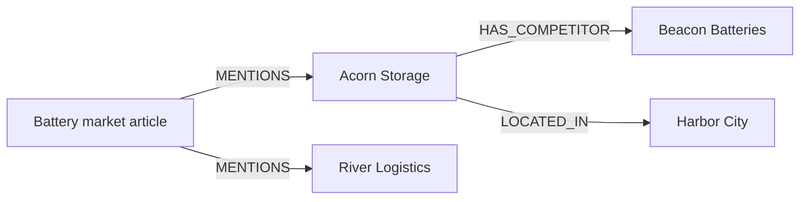

# neo4jev

[All projects](../README.md) · [Search and retrieval](README.md#search-and-retrieval)

Explore how a natural-language goal can guide a search through existing Neo4j relationships, with a visible record of the alternatives considered at each step.

| At a glance | Details |
| --- | --- |
| Source | [Source](https://github.com/jexp/neo4jev) |
| Maintainer | [Michael Hunger / jexp](https://github.com/jexp). Independently curated; this is not an upstream submission or endorsement. |
| Format | Python library, three notebooks, and a local Streamlit app. |
| Requirements | Python ≥3.12 and uv; reviewed with Python 3.14.4. Lockfile includes `typesafe-sdk` 0.6.0, `neo4j-rust-ext` 6.3.1.0, `neo4j-viz` 1.8.0, and Streamlit 1.64.0. Live exploration needs Neo4j access; navigation needs a TypeSafe account/key. |
| License | [MIT](https://github.com/jexp/neo4jev/blob/d157bbe496eb91813475156942bef1c6badfb342/LICENSE). |

## When to use

Use this as a reference for exploring company relationships, following an article to related organizations, or investigating a graph whose useful route depends on semantic context. Start with the offline tests below.

If you already know the exact relationship pattern or need a shortest-path guarantee, a deterministic graph query is simpler. neo4jev searches a limited selection of routes; it does not establish that no other useful path exists. For ranking an already retrieved set of passages, see [llama-index-jev](llama-index-jev.md).

## How it works

The [navigator](https://github.com/jexp/neo4jev/blob/d157bbe496eb91813475156942bef1c6badfb342/src/neo4jev/navigator.py) gives each candidate edge an opaque key such as `e0`. Its Choice criteria describe the relationship and destination properties. The state supplies the current node, goal, path history, and optional graph schema.

One `system_one` invocation asks which edge advances the goal and whether the **current node** already satisfies it. A leaf receives only the Noul question. [Choice](https://docs.typesafe.ai/primitives/choice) returns competing option probabilities; [Noul](https://docs.typesafe.ai/primitives/noul) returns the probability of yes, without a separate confidence value.

Code keeps up to `top_k` branches above a cutoff, ranks paths by the sum of their log probabilities, and retains `beam_width` candidates for further exploration. Defaults are top-k 2, cutoff 0.05, beam width 4, depth 4, and 24 navigation invocations. Independent branches expand concurrently; each branch consumes its own invocation.

| Goal mode | What makes a path stop successfully |
| --- | --- |
| Free text | The current node's Noul reaches `goal_threshold`, default 0.5. |
| Target node | Code matches the exact Neo4j element ID; Noul cannot override that check. |
| Path intent | Noul judges the final stage; hop-indexed stage descriptions guide Choices. Up to `top_n` distinct node sequences are returned. |

Path intent is semantic guidance, not a validated Cypher pattern. A returned path can also end at a depth limit, exhausted budget, or dead end. Always inspect `terminated_reason`.

## A worked scenario

This is an original **synthetic illustration**, not an upstream dataset or recorded model result:



Start at the article with the path intent `organizations mentioned in this article -> their battery-manufacturing competitors`. Use the ASCII `->` separator: this revision does not split stages on the typographic `→` arrow. Node properties must supply the industry evidence; names alone may be insufficient.

Suppose the article's Choice assigns Acorn 0.70 and River 0.30. With top-k 2, both survive. At Acorn, suppose Beacon receives 0.80 and Harbor City 0.20. The Acorn–Beacon route then has score `log(0.70) + log(0.80)`, approximately −0.58. On a subsequent expansion at Beacon, a synthetic Noul of 0.90 crosses the default stopping threshold.

That route alone needs three node evaluations, although it traverses two edges. Expanding River, Harbor City, or other sibling branches consumes additional calls from the shared budget. Give a semantic goal enough depth and call budget to judge the destination. The score orders explored routes; it is not a measured probability that the whole path is correct.

## Get started

**Download and install:** these commands use GitHub and package registries, but make no Neo4j or TypeSafe calls. Python 3.14 reproduces this review; upstream's `.python-version` defaults to 3.12.

```sh
git clone https://github.com/jexp/neo4jev.git
cd neo4jev
git checkout d157bbe496eb91813475156942bef1c6badfb342
uv sync --frozen --python 3.14
```

**Offline check:** no `.env`, accounts, or provider keys are needed.

```sh
PYTHON_DOTENV_DISABLED=1 uv run --offline --frozen --python 3.14 pytest tests/unit -q
```

Expected result at this revision: **161 passed**. The tests use fake graph drivers, scripted judgments, and a mocked SDK transport. Read [the navigation tests](https://github.com/jexp/neo4jev/blob/d157bbe496eb91813475156942bef1c6badfb342/tests/unit/test_navigator_scoring.py) to see branching and stopping without a live service. This verifies code behavior, not Jev's judgment quality.

**Optional live exploration:** follow the [upstream setup](https://github.com/jexp/neo4jev/blob/d157bbe496eb91813475156942bef1c6badfb342/README.md#setup), configuring `NEO4J_URI` (or `NEO4J_URL`), `NEO4J_USERNAME`, `NEO4J_PASSWORD`, `NEO4J_DATABASE`, and `TYPESAFE_API_KEY` privately. The supplied template targets a remote public Companies KG. Database queries and TypeSafe requests leave your machine; provider/database charges may apply.

```sh
uv run --frozen --python 3.14 streamlit run app/streamlit_app.py
```

Start with outgoing direction, top-k 1, maximum depth 3, and maximum navigation calls 3. Choose a start node and a narrow free-text goal. The app renders paths and a per-hop trace. Label-caption derivation can make additional TypeSafe calls while browsing, outside that navigation budget.

## Examples and demos

The [notebooks](https://github.com/jexp/neo4jev/tree/d157bbe496eb91813475156942bef1c6badfb342/notebooks) cover schema exploration, one-hop inspection, and full traversal. No separate hosted demo is documented.

Despite its name, `02_navigator_dry_run.ipynb` reads the remote graph and attempts TypeSafe inference. Notebook fallbacks label synthetic answers explicitly. The current app instead blocks navigation without a key and displays an error when navigation fails; the README's broader claim of app stand-ins does not match this revision.

## Adaptation tips

1. **Check candidate coverage first.** The [access layer](https://github.com/jexp/neo4jev/blob/d157bbe496eb91813475156942bef1c6badfb342/src/neo4jev/neo4j_access.py) retains at most 10 edges per type and 60 overall, interleaving types. Omitted edges cannot win. Inspect its truncation counts before changing questions.
2. **Start with outgoing relationships.** Incoming traversal lacks destination properties; `both` incorrectly marks incoming edges as outgoing at this revision, causing the visited-node guard to discard them. Target-node stopping is exact, but Choice criteria omit destination element IDs, limiting informed routing toward an opaque target ID.
3. **Define uncertain outcomes in your application.** If every edge falls below cutoff, the code still takes the best one. Missing Noul does not mean success; missing Choice produces no branches. Add an explicit review or stop policy if your adaptation needs abstention.
4. **Evaluate completed paths separately.** Path ranking does not prioritize successful terminations over dead ends, and unnormalized log sums can favor shorter routes. Validate required relationship patterns in code and inspect each termination reason.

## Limits and data handling

Navigation retains candidate probabilities and Noul values in recorded steps. `one_hop` also exposes Choice confidence, but full results do not preserve it, token usage, or every discarded expansion. Preserve complete responses separately when evaluating an adaptation.

The library propagates navigation failures. The app displays them and clears the failed result. Caption inference has a local heuristic fallback. The SDK defaults to `jev-latest` unless overridden, and [allows two retries by default](https://docs.typesafe.ai/sdk/python/api/retries); `max_calls` counts navigation invocations, excluding retries and caption derivation, so it is not a total request or spending limit.

TypeSafe receives goals, graph context, candidate properties, and sampled caption-property values. Prompt preparation drops lists and truncates long strings to 200 characters; this is payload reduction, not privacy filtering. Full graph properties may remain in Python objects, Streamlit session/browser views, and saved notebook output. Database operations inspected here are reads. The default vector embedder is a deterministic placeholder, so vector lookup does not provide meaningful semantic retrieval.

## Review and maintenance

AI-assisted review on **2026-09-19** at [d157bbe496eb91813475156942bef1c6badfb342](https://github.com/jexp/neo4jev/tree/d157bbe496eb91813475156942bef1c6badfb342). Inspected the license, README, configuration, core modules, app, notebooks, and tests. Frozen installation succeeded; **161 unit tests passed** on Python 3.14.4 in an isolated environment without provider credentials. An additional synthetic mapping check confirmed the incoming/`both` caveats. Live databases, inference, browser rendering, integration tests, Python 3.12, and model quality were not tested.

Related: [TypeSafe's hierarchical-classification cookbook](https://docs.typesafe.ai/cookbooks/hierarchical_classification) shows a different beam-search design for trees, using geometric-mean path scoring.
