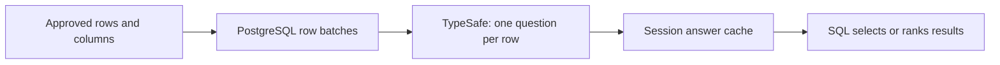

# pg-jev

[All projects](../README.md) · [Search and retrieval](README.md#search-and-retrieval)

Find rows whose text expresses a meaning—such as an explicit cancellation request—and inspect the judgment directly in PostgreSQL.

| At a glance | Details |
| --- | --- |
| Source | [Source](https://github.com/realZachi/pg-jev) |
| Maintainer | [Zachi / realZachi](https://github.com/realZachi). Independently curated; this page is not an upstream submission. Upstream states it is unaffiliated with TypeSafe. |
| Format | PostgreSQL extension implemented in SQL and PL/Python. |
| Requirements | Upstream targets PostgreSQL 14–17, `plpython3u`, Python 3, and superuser installation. Source installation uses PGXS/`pg_config`; the test container supplies its dependencies. Live use needs server HTTPS access and a TypeSafe account/key. |
| Key configuration | `TYPESAFE_API_KEY` in the PostgreSQL server environment, or the `jev.api_key` session setting. |
| License | [PostgreSQL License](https://github.com/realZachi/pg-jev/blob/afd11fa856d7a2b831a1bfd8ee7f869ce8efcd62/LICENSE). |

## When to use

Use it for exploratory queries over support messages, qualitative product descriptions, or other text already in a PostgreSQL database you administer. You write the SQL and the semantic question; Jev does not generate SQL or choose database permissions.

Keep status checks, tenant IDs, dates, arithmetic, and exact matches in SQL. A keyword query is simpler when literal wording is sufficient. For a large search collection, retrieve a small candidate set first; [llama-index-jev](llama-index-jev.md) is another option when retrieval lives in a Python application. Hosts that do not allow `plpython3u` and the required installation privileges cannot use this extension as documented.

## How it works



The [v0.2 implementation](https://github.com/realZachi/pg-jev/blob/afd11fa856d7a2b831a1bfd8ee7f869ce8efcd62/sql/jev--0.2.0.sql) serializes rows into shared JSON state and sends typed questions to `/v1/systemone`. The default model is `jev-latest`. Named tables and views support read-ahead batching; anonymous records generally require individual requests.

`jev_prob()` returns a Noul probability; `jev()` compares it with a threshold, defaulting to `0.5`. `jev_choice()` selects an option, and `jev_score()` rates ordered levels. Use `jev_eval()` to retain the raw answer. A [Noul](https://docs.typesafe.ai/primitives/noul) has no separate confidence: a value near `0.5` means yes and no have similar probability.

## Get started

Start with the [synthetic regression example](https://github.com/realZachi/pg-jev/blob/afd11fa856d7a2b831a1bfd8ee7f869ce8efcd62/test/sql/01_basic.sql) and its [expected output](https://github.com/realZachi/pg-jev/blob/afd11fa856d7a2b831a1bfd8ee7f869ce8efcd62/test/expected/01_basic.out). They show probabilities, thresholds, caching, Choice, and Score without needing an account. No hosted interactive demo was reviewed.

**Provider-free test path, with Docker running:** fetching source and building the image downloads public dependencies. The test itself uses a local mock, creates a temporary database inside the container, and sends no requests to TypeSafe. These container commands were inspected but not executed in this review.

```sh
git clone https://github.com/realZachi/pg-jev.git
cd pg-jev
git checkout afd11fa856d7a2b831a1bfd8ee7f869ce8efcd62
docker build -t pg-jev-test -f test/Dockerfile .
docker run --rm pg-jev-test
```

The runner's success message is `jev: all regression tests passed`. Its mock uses string matching and row length; even its intentionally arbitrary city classifications are test fixtures, not model judgments.

For an actual installation, follow the pinned [installation instructions](https://github.com/realZachi/pg-jev/blob/afd11fa856d7a2b831a1bfd8ee7f869ce8efcd62/README.md#install). Configure credentials privately on the server; do not put them in shared SQL files.

## A support-ticket example

This original scenario illustrates how to separate eligibility from meaning. Two open tickets need review; one closed ticket is excluded before inference.

**Offline SQL preparation in a fresh, disposable PostgreSQL session:** no extension or provider call is needed for this block.

```sql
CREATE TEMP VIEW demo_tickets AS
SELECT id, body
FROM (VALUES
  (1, 'open', 'Please cancel my subscription.'),
  (2, 'open', 'I do not want to cancel; please fix my login.'),
  (3, 'closed', 'Please cancel my subscription.')
) AS t(id, status, body)
WHERE status = 'open';

SELECT * FROM demo_tickets ORDER BY id;
```

The result contains IDs `1` and `2`, with only `id` and `body`. Both mention cancellation, so simple keyword matching cannot express the intended distinction reliably.

**Optional live integration fragment, not executed here:** in that same session, with `jev` installed and a key configured, the following sends the two synthetic rows to TypeSafe and may incur charges. The row guard bounds submitted rows, while transport retries may repeat a request.

```sql
SET jev.batch_size = 2;
SET jev.concurrency = 1;
SET jev.max_rows_per_statement = 2;

SELECT id, jev_eval(d,
  'The customer explicitly requests cancellation of their subscription in body'
) AS cancellation_answer
FROM demo_tickets AS d
ORDER BY id;
```

Expect one raw Noul answer per row, not a cancellation action. The desired interpretation is yes for `1` and no for `2`; no measured probabilities are claimed. Your application should validate answers and retain uncertain cases for review.

## Adaptation tips

- **Define the input relation deliberately.** Put eligibility rules and column projection inside the view passed to Jev; an outer `WHERE` is not a reliable provider-data boundary.
- **Ask one concrete question.** Separate cancellation intent from frustration or urgency. The SQL condition must carry the meaning; internal question IDs do not instruct the model.
- **Keep judgments inspectable.** Store raw answers with row/version identifiers and question/model settings if you build a durable review workflow; the extension only supplies session caching.
- **Evaluate before automating.** Include negation, quoted text, missing context, and ambiguous requests. Choose review thresholds from your own labeled examples.

## Limits and data handling

**Read-ahead affects both privacy and spending.** A fresh miss can queue up to twice the configured concurrency in batches; defaults are 16 workers and 20 rows per batch. Neighboring rows may be submitted even when an outer filter or `LIMIT` excludes them from the result. The [streaming test](https://github.com/realZachi/pg-jev/blob/afd11fa856d7a2b831a1bfd8ee7f869ce8efcd62/test/sql/03_streaming.sql) permits up to 800 evaluated rows for a five-row filtered result. Row/character guards default to off and reject new batches; they cannot undo requests already sent. Retries can add work.

**Database permissions still need deliberate setup.** Functions use PostgreSQL's default [invoker privileges](https://www.postgresql.org/docs/17/sql-createfunction.html), but upstream does not restrict default function execution privileges. View ownership and [row-security bypass rules](https://www.postgresql.org/docs/17/ddl-rowsecurity.html) affect visibility; this review did not validate tenant isolation. A configurable `jev.api_url` receives the authorization key, so do not expose a server-wide key to unrestricted SQL callers.

**Cache and errors need application policy.** Row JSON, queued work, and answers live in backend memory. Cache keys omit model, endpoint, and role; use a fresh backend when changing those contexts. Missing answer IDs and nonretryable HTTP errors fail the query; transient transport/server failures retry up to seven attempts. Individual answer fields are not fully validated: missing fields can become SQL `NULL`. There is no built-in review queue.

Live row data goes to TypeSafe, or the configured alternate endpoint. The extension does not create durable result tables. Provider retention was not assessed. `jev_stats()` reports usage and a hard-coded price estimate; check [current model pricing](https://docs.typesafe.ai/models) before budgeting. Upstream speed and accuracy claims were not reproduced.

## Review and maintenance

Reviewed **2026-09-19**, version **0.2.0**, commit [`afd11fa`](https://github.com/realZachi/pg-jev/commit/afd11fa856d7a2b831a1bfd8ee7f869ce8efcd62). AI-assisted inspection covered the SQL, license, installation, test harness, fixtures, and current TypeSafe HTTP/Noul documentation.

Offline checks compiled all three PL/Python bodies and passed five loopback mock requests covering Noul, Score, Choice, HTTP 401, and HTTP 422. These did not execute the extension in PostgreSQL. The full regression suite and example SQL remain unrun: PostgreSQL tools were absent from PATH and the Docker daemon was unavailable. No installation, live inference, performance evaluation, or permission-isolation test was performed.

Related: [Support routing](../../../examples/support-routing/README.md) provides a smaller offline introduction with explicit review behavior. See [catalog validation scope](../../../docs/validation.md#community-project-checks).
