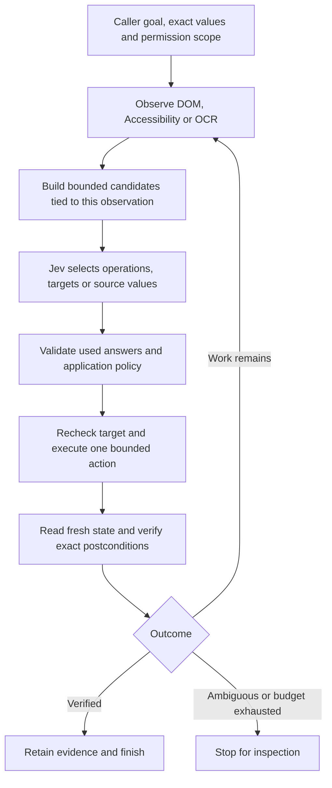

# Computer and browser use with Jev

[Awesome Jev](../README.md) · [Project directory](../community/README.md#browser-and-computer-use) · [Run the offline example](../examples/computer-use/README.md)

Jev can choose the next UI operation, match a field to a supplied value, or select text to extract. A browser or native driver must supply observations and execute the choice. The current [TypeSafe state interface](https://docs.typesafe.ai/concepts/state) takes text or structured data; screenshot interpretation requires OCR, Accessibility/DOM extraction, or another model.

Start with [a first result](#get-a-first-result), [choose a project](#choose-a-starting-point), or jump to [common use cases](#common-use-cases). The later sections explain [forms and extraction](#forms-and-extraction), [native app tests](#macos-and-ios-app-tests), and [verification](#turn-exploration-into-useful-tests).

## Get a first result

**1. Run the small example.** You need Git and Python 3.10+; no Node.js, browser installation, or API key. In a terminal:

```sh
git clone https://github.com/AppitStudio/awesome-jev.git
cd awesome-jev
python3 examples/computer-use/run.py
```

If you already have this checkout, run only the final command from its root. On Windows, use `py -3` if `python3` is unavailable. Expect `"status": "simulated_verified"` and five `true` checks. The example fills a synthetic billing field and returns the exact amount due. No real UI is touched. Its [walkthrough](../examples/computer-use/README.md) explains every output field.

**2. Pick one real implementation below.** Open its project guide and follow the offline/check path first. Each guide explains the prerequisites, installation directory, expected result, a first task, and troubleshooting. You do not need all five tools; they cover different environments.

**3. Enable live use for a small test task.** Follow that project's key setup and request/action bounds. Use its synthetic fixture or your own disposable test app. Confirm the result using the guide's exact assertions or state checks before adapting it to a larger workflow.

These modes mean different things:

| Mode | Calls Jev? | Controls a real UI? | Start here for |
| --- | --- | --- | --- |
| This catalog's default example | No | No | Learning the decision and verification code. |
| This catalog's example with `--live` | Yes, at most one HTTP attempt | No | Checking a request with synthetic state. |
| Cua's mock browser proof | No | Yes, a local fixture | Checking Driver installation and execution. |
| An upstream live agent | Yes | Yes | Testing a complete task on an explicitly selected surface. |

A command named “preview” or “dry run” may still read a device and send its state to a provider. Each guide labels the actual behavior.

## Choose a starting point

For **browser forms, extraction, and application tests**, start with **[Jev Browser (tontoko)](../community/projects/jev-browser-tontoko.md)**. Among this source-reviewed shortlist, its existing Playwright integration, record-level extraction evidence, explicit input binding, and caller-defined assertions make it the closest fit. For a small loop you can read and modify, choose [Jev Ultrafast](../community/projects/jev-ultrafast.md). Neither recommendation is a benchmark ranking or a claim of production readiness.

| Need | Starting point | What is available; what remains |
| --- | --- | --- |
| Browser navigation and understanding the decision loop | [Jev Ultrafast](../community/projects/jev-ultrafast.md) | Observed DOM targets, inspector, separate text helper. Add workload-specific assertions and action policy. |
| Fill forms, extract tables, or augment Playwright tests | [Jev Browser (tontoko)](../community/projects/jev-browser-tontoko.md) | SDK/CLI/MCP, supplied values, source evidence, native and semantic assertions. Configure permissions and verify backend effects where needed. |
| Native macOS apps | [typesafe-computer-use](../community/projects/typesafe-computer-use.md) | Local OCR + Accessibility, action choices, optional writing model. Add app/window restrictions and deterministic test assertions. |
| Build a driver integration with an independent verifier | [Cua jev-use](../community/projects/cua-jev-use.md) | Bounded chooser and a browser fixture verified through `/state`. Native task support and optional perception need separate validation. |
| Android app navigation and input | [Mobile Jev](../community/projects/mobile-jev.md) | Mobilerun device control, exact text selection, studio, dark-theme verifier. Requires a device/service account; generic `done` still needs an oracle. |
| iOS Simulator experiments | [Jev + AXe demonstration](#ios-simulator-evidence) | Public author demonstration; the reviewed AXe default branch did not expose a Jev integration. Treat the adapter below as proposed work. |
| Learn without credentials or a driver | [Offline computer-use cycle](../examples/computer-use/README.md) | Runnable synthetic form/extraction example, stale-state checks, raw answers, and independent assertions. No real UI adapter. |

Each project guide includes its upstream source, license, exact reviewed revision, setup, data flow, and limitations. There is no single implementation here demonstrated to cover browser, macOS, and iOS app tests equally well.

## Common use cases

These are practical starting tasks, not measured popularity or success claims. The project guides distinguish built-in demos from adaptations you need to implement.

| Task | Start with | What you supply | What proves success |
| --- | --- | --- | --- |
| Fill a staging customer form with changing labels | [Jev Browser](../community/projects/jev-browser-tontoko.md) | Explicit fictional values and a permitted form/action scope | Exact values on the saved test record; unrelated fields unchanged. |
| Extract invoices or product rows | [Jev Browser](../community/projects/jev-browser-tontoko.md) | A record scope, field schema, and pagination rule | Each value points to its source row; coverage and missing fields are reported. |
| Navigate a site and open the intended result | [Jev Ultrafast](../community/projects/jev-ultrafast.md) | A starting URL and concrete goal | The expected URL/content is present, checked independently. |
| Turn a new UI path into a regression test | [Jev Browser](../community/projects/jev-browser-tontoko.md) | A disposable test app and Playwright assertions | All exact assertions pass; preserve the successful path as a conventional test. |
| Explore a native Mac app's controls | [typesafe-computer-use](../community/projects/typesafe-computer-use.md) | A test desktop, a small goal, and app-specific checks | Fresh field/setting readback or test-app state, beyond the model's `done`. |
| Add a decision layer to an existing driver | [Cua jev-use](../community/projects/cua-jev-use.md) | Observations, immutable candidates, permissions, and an independent verifier | A trusted state check matches the requested postcondition. |
| Exercise an Android settings or input flow | [Mobile Jev](../community/projects/mobile-jev.md) | A Mobilerun test device, exact input values, and a reset procedure | Device state matches the full goal; the dark-theme demo includes a dedicated check. |
| Investigate iOS Simulator automation | [Jev + AXe evidence](#ios-simulator-evidence) | A separately implemented and validated adapter | XCTest/XCUITest or fixture state verifies the final result. No released Jev adapter was verified here. |

### Let the guide help you adapt one

Install the repository's [Awesome Jev Guide](using-the-guide.md), then give your agent a concrete starting request:

```text
Use awesome-jev-guide and the computer-use section in Awesome Jev.
I want to [fill a staging form / extract table rows / test a native app].
My environment is [OS, language, browser or device].
Choose one reviewed implementation and help me run its offline first step.
Then explain the exact inputs, live-call limits, and assertions I need.
Work in my application, keeping private data out of the public catalog.
```

## A useful architecture



Keep three contracts separate:

1. **Observation:** which surface, revision, controls, values, and records were actually observed? An omitted control cannot be selected correctly. Preserve row, frame, window, app, and device identity as appropriate.
2. **Action:** which operations has the caller permitted, with which exact values? Jev chooses among candidates; it cannot grant access, invent a selector, or authorize a submission. Recheck the selected control immediately before dispatch.
3. **Success:** what independent facts prove the task finished? Use exact field values, changed test records, a backend response, or platform test assertions. A model's `done` is a stop proposal.

An operation and its possible targets can be asked together using [speculative fan-out](https://docs.typesafe.ai/patterns/fan-out). Consume only the matching target's confidence. Batch independent field bindings on a stable form, then execute inputs serially and check each result. After a dependent dropdown or navigation changes the available controls, observe again before choosing new targets. More questions are not free; measure tokens as well as the number of requests.

## Forms and extraction

**Form example:** enter a caller-supplied billing email into “Accounts payable,” preserve the shipping email, and stop before payment. Jev resolves the label's meaning. Code supplies the exact email and permits only editing. Tests assert both the desired change and the field that must remain unchanged. Missing values should ask for input rather than trigger invented personal details.

**Extraction example:** collect each visible invoice number and its amount due. First delimit rows/cards in code; then let Jev select the relevant source within each record. Return the exact text with its source ID, page URL, and observation identity. Parse money/dates and calculate totals in code. Record pagination and missing fields explicitly: extracting every observed row does not prove every row on the website was visited. The [span-selection example](../examples/span-selection/README.md) teaches the smaller source-copying pattern.

Avoid sending whole pages by default. A relevant region often contains the necessary labels and values, but truncating it can remove the true candidate. Diagnose coverage before adjusting questions. Explicit input-value binding can reduce exposure; it does not hide values that a page echoes into text or URLs.

## macOS and iOS app tests

Use semantic decisions to explore varied wording or unfamiliar screens. Keep stable regression checks deterministic when accessibility identifiers or known selectors already express the task.

| Layer | macOS adaptation | iOS Simulator adaptation |
| --- | --- | --- |
| Observe | App/window-scoped Accessibility tree; local OCR for missing text | Simulator UDID plus AXe `describe-ui` output |
| Candidate | Allowed controls with identity, role, enabled state and supported action | Allowed Simulator elements with label/identifier and supported action |
| Execute | Fresh Accessibility reference; explicit coordinate fallback only where justified | AXe tap/type primitives against the selected Simulator |
| Verify | XCUITest or a test-app state endpoint checks the persisted result | XCTest/XCUITest or app fixture state checks the result independently |
| Reset | Disposable app data and predictable window state | Disposable Simulator/test app data, known locale and starting screen |

These are **adaptation designs**, not shipped adapters in this catalog. Add a platform-specific test app and observe/execute/verify contract before claiming support. Do not expose arbitrary shell commands through a candidate description. Re-observation reduces stale-target errors but cannot make a remote click and its checks atomic; inspect ambiguous outcomes before replaying.

### iOS Simulator evidence

Cameron Cooke's [September 17 Jev + AXe post](https://x.com/camsoft2000/status/2100648648434434298) demonstrates Simulator control. His [typing explanation](https://x.com/camsoft2000/status/2100675440004289011) says AXe extracts text from the prompt, while Jev selects the typing action. His [follow-up](https://x.com/camsoft2000/status/2100838015857782784) describes adding an agent command to AXe.

The public [AXe source reviewed at 30f4bfa](https://github.com/cameroncooke/AXe/tree/30f4bfa9bc81817906a60fadedbc913d7314b7e1) documents the underlying Simulator CLI, but no Jev/agent implementation was found in that default-branch tree on **2026-09-19**. No Jev-related PR was found in the repository search. We therefore do not give an `axe agent` installation command or claim a released iOS Jev test framework. The demonstration does not establish physical-device support, repeatable test quality, or its reported speed/cost. AXe's ordinary CLI is MIT licensed; a social demo does not establish the unavailable integration's licensing or reproducibility.

## Turn exploration into useful tests

- Define expected final state **before** observing model answers. Include negative requirements such as “delivery address unchanged” or “no submission.” Keep golden answers out of the decision payload.
- Separate decision-contract tests, real-driver tests with mocked decisions, bounded live smoke checks, and representative task evaluations. Each proves something different.
- Test confusing labels, missing controls, delayed rendering, changed windows, disabled fields, no-match answers, stale refs, and transport failures after mutation.
- Record completion, incorrect completion, review/abstention, and budget exhaustion separately. Measure end-to-end time including observation, waits, verification, retries, and any writing model; include failed runs.
- Retain successful exploratory traces as debugging evidence. Convert stable paths into conventional regression tests instead of making every future CI run depend on inference.

The [new runnable example](../examples/computer-use/README.md) demonstrates these boundaries with synthetic data. It includes deliberately wrong-but-valid choices that fail exact assertions; syntactic validity and confidence do not establish semantic correctness.

## Discovery and review scope

Research on **2026-09-19** used X search and original author posts, GitHub repositories, and official TypeSafe documentation. Social demonstrations supplied leads, not verification. In particular, the [Cua announcement](https://x.com/trycua/status/2100649543079502213) must be read alongside its merged recipe and still-draft perception work; their status is explained in the project guide.

This is a selective catalog, not a list of every repository named Jev Browser. For example, [JevTest](https://github.com/CorieW/JevTest/tree/cb5326eb2419e9a7612f8de5a596039e10b1916b) was considered for exploratory testing, but its reviewed README states that no usage license has yet been granted. It is not recommended here as an adoptable starter. Future reviews can revisit its licensing.

See [exact validation results](validation.md#computer-use-review). Reviews and the original example were prepared with AI assistance. No live provider call, personal desktop action, phone/Simulator control, or performance benchmark was run for this addition.
