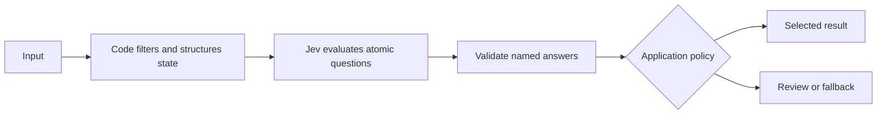

# Designing a Jev decision

Jev evaluates text or structured state against typed questions. Start with one judgment your application needs, define the possible answers, and decide what your code should do when the answer is uncertain. The [official design guide](https://docs.typesafe.ai/concepts/how-to-build-with-system-one) develops this approach.

## Choose the answer shape

| You need to… | Use | Read | Example |
| --- | --- | --- | --- |
| Select from a finite set | Choice | `choice`, `probabilities`, `confidence` | Which support queue fits this ticket? |
| Place something on a descriptive rubric | Score | `score`, `legend`, `probabilities`, `confidence` | How complete is this bug report? |
| Evaluate a yes/no condition | Noul | `noul` | Does the ticket explicitly request a person? |

See the official [Choice](https://docs.typesafe.ai/primitives/choice), [Score](https://docs.typesafe.ai/primitives/score), and [Noul](https://docs.typesafe.ai/primitives/noul) references for request shapes and limits.

A Score is a probability-weighted position among zero-based rubric levels. With three levels its range is 0–2; it is not automatically a percentage. Write each level as a concrete, standalone description. For example, “Names a failing operation and provides reproduction steps” is more useful than “Good” or “Better than the previous level.”

Noul returns the estimated probability of “yes.” A value near zero indicates “no,” not low confidence in a positive answer. Noul has no separate `confidence` field. Choice and Score confidence summarize their distributions; confidence is not a guarantee of correctness or a universally calibrated accuracy percentage. See [Confidence](https://docs.typesafe.ai/confidence).

## Keep the decision pipeline visible

Write the complete question in `instructions`. Question IDs associate responses with your code; the model does not use them to infer the question. Read answers by ID, never by response order. Questions in one request share the state and are evaluated independently. A question cannot consume a sibling's answer in that same call. Use another call when a later decision actually depends on an earlier result. See the [HTTP contract](https://docs.typesafe.ai/api) and [fan-out pattern](https://docs.typesafe.ai/patterns/fan-out).

For a Choice, include an explicit “none” or “other” outcome when no candidate may fit. For a Noul, define separate negative and positive thresholds with a review interval between them. For multiple Scores, normalize compatible scales and choose weights in code. Those thresholds and weights are application policy, not model facts. The [composite scoring pattern](https://docs.typesafe.ai/patterns/composite-scoring) shows this separation.

## Evaluate the policy

Use labeled examples representative of your actual workload, including ambiguous and missing information. Tune on a development set and assess a separate held-out set. Measure both errors and the fraction of cases handled automatically: a policy that reviews everything has low coverage even if its automatic decisions make no mistakes. Count transport and validation failures separately from model errors.

Record the requested and returned model IDs, question version, threshold settings, latency, and token use. Re-evaluate after changing the model, wording, options, or data distribution. Our [starter examples](../examples/README.md) use synthetic fixtures to test code paths; those fixtures provide no accuracy evidence.

## Know the boundary

Keep counting, arithmetic, date comparison, permissions, and execution rules in code. For extraction, code can find candidate source spans and ask Jev which one fits. Jev does not generate an arbitrary missing value. State can contain misleading instructions, and model-based screening is not a security boundary. These limitations are documented in [Jev 1.13 jaggedness](https://docs.typesafe.ai/model-jaggedness/jev-1.13).

Use the [current model reference](https://docs.typesafe.ai/models) for supported inputs, version IDs, pricing, and context limits. Aliases can move; pin a model version when comparing evaluations or tuning a policy.
