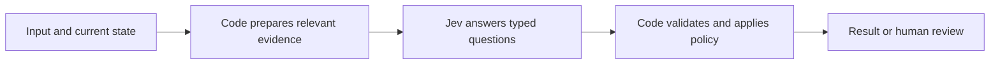

# Explore what you can build with Jev

[Awesome Jev](../README.md) · [Project directory](../community/README.md) · [Ask the guide skill](using-the-guide.md)

Start with something your software needs to **choose, assess, or select**. Jev supplies typed judgments; your application supplies the data, decides what the answers mean, and carries out the work. The projects below show that division in inspectable implementations, from a small library to a complete application.

**New to Jev?** Run the [support-routing example](../examples/support-routing/README.md) first. It uses synthetic inputs and scripted answers, works without an account, and makes the state → questions → policy flow visible. Then choose one project that resembles your own workflow.

From an Awesome Jev checkout with Python 3.10+, run:

```sh
python3 examples/run.py support-routing --mock
```

It prints a routing decision from fixtures without sending data or assigning a ticket. The community projects below each have their own setup and execution requirements.

## Choose by the result you want

| I want to… | Start with | What to explore first |
| --- | --- | --- |
| Guide a browser through a task | [Jev Ultrafast](../community/projects/jev-ultrafast.md) | How one observed element table supports both an operation and its possible targets. A text model supplies typed text when needed. |
| Fill forms, extract records, or test browser/native interfaces | [Computer and browser use](computer-use.md) | Compare Playwright, native macOS, Android, and driver recipes; distinguish iOS demonstrations from available integrations. Start with the offline form/extraction cycle. |
| Reduce an agent's old tool history | [fast-jev-compaction](../community/projects/fast-jev-compaction.md) | The library's keep, truncate, and remove decisions; inspect the synthetic demo before connecting a real conversation. |
| Ask semantic questions of database rows | [pg-jev](../community/projects/pg-jev.md) | How SQL calls become typed judgments, and why read-ahead and ordinary SQL filters affect what data is sent. |
| Search across sources with editable filters | [Jev Search](../community/projects/jev-search.md) | Query/source selection, retrieval, and relevance ranking as separate stages. |
| Send useful logs to deeper investigation | [Jev Logs](../community/projects/jevlogs.md) | Mock mode, protected records, and a separate analysis branch alongside the existing archive. |
| Turn household context into a useful reminder | [Jev for Home Assistant](../community/projects/ha-jev.md) | Read-only state selection and judgment sensors before connecting an automation. |
| Find a useful path through a knowledge graph | [neo4jev](../community/projects/neo4jev.md) | Next-hop candidates, branching search, and the difference between semantic goals and exact target matching. |
| Add typed classification to a Laravel app | [Laravel AI](../community/projects/laravel-ai.md) | The classification interface, TypeSafe provider, and fake responses; check which package version contains the integration. |
| Understand how AI answers mention a brand | [Notra](../community/projects/notra.md) | The mention-evaluation component before attempting the full application setup. |

These are complementary starting points, not a ranking of model performance. Each guide identifies its reviewed revision, prerequisites, license, data recipients, tests, and remaining gaps. Most real workflows use hosted inference; an offline test or mock demo does not run Jev locally.

## Find an app to use

The [app directory](../community/README.md#apps-powered-by-jev) lists user-facing products separately from developer tools. Start there for a macOS click assistant, a search interface, or a brand-visibility application. Each listing explains what Jev powers, what other components do, supported platforms, and whether access is hosted or requires a source build. Makers can [share their own apps](../CONTRIBUTING.md#list-a-jev-powered-app).

## Follow one decision through the system

Consider a fictional support message: “My export has failed twice since this morning.” A useful application could ask which team should inspect it and separately whether it reports a blocked task. It would retain the answers and apply its routing policy. If the evidence is missing or the answer is uncertain, it could put the message in a review queue.



The same structure appears in very different products:

- A browser supplies **observed elements**, then code executes the selected operation against a fresh page.
- A graph supplies **outgoing relationships**, then code expands selected paths within a search budget.
- A transcript library supplies **conversation context**, then code preserves or removes linked tool-call/result pairs.
- A visibility tool supplies **a brand and an existing answer**, then code stores judgments and calculates reports.

Jev does not fetch the missing page, discover an omitted graph edge, calculate the business metric, or grant permission to act. Those responsibilities stay visible in the surrounding application. See the [decision-pattern guide](decision-patterns.md) for choosing Choice, Score, or Noul.

## Make the first experiment useful

Pick one decision and a handful of synthetic cases you can understand completely. For log triage, include a routine event, an obvious failure, an ambiguous message, and a provider error. For graph navigation, include a dead end and a goal absent from the available graph. Write down the desired application behavior before looking at judgments.

Use the project's existing mock or test path where available. An installation command may download dependencies; a command described as a dry run may still read a remote database or service. The individual guides distinguish these paths. When you later enable live inference, start with a bounded request budget and non-private inputs.

Keep three things separately inspectable: **the evidence sent**, **the raw typed answers**, and **the final application decision**. This helps distinguish incomplete inputs from model mistakes and policy bugs. A score displayed as a percentage is not automatically an accuracy estimate, and a concentrated answer distribution is not authorization to perform an action.

Change one aspect at a time. Adjusting code-side weights can reuse stored answers if the evidence and question meanings are unchanged; changing the questions or candidate set needs fresh judgments. Before relying on a workflow, evaluate representative labeled cases and its review/failure behavior. The [evaluation guide](../evaluations/README.md) demonstrates this process for support routing.

## Ask an agent to adapt a project

The [Awesome Jev Guide skill](using-the-guide.md) can turn a selected guide into a concrete next step. Give it your outcome, stack, and a boundary:

```text
Use awesome-jev-guide and the Jev Logs project guide. I have a Node.js
service and want to prioritize logs for investigation while keeping
every event in my existing archive. Start with synthetic data, show
me the decisions, and explain what needs adapting before live use.
```

Already working with customer feedback, RAG, or .NET? The [full directory](../community/README.md) also covers Testimonial miner, llama-index-jev, Jev Review, and TypeSafeAI.Net. Choose the smallest existing piece that solves your next problem, and keep your application in its own repository.
